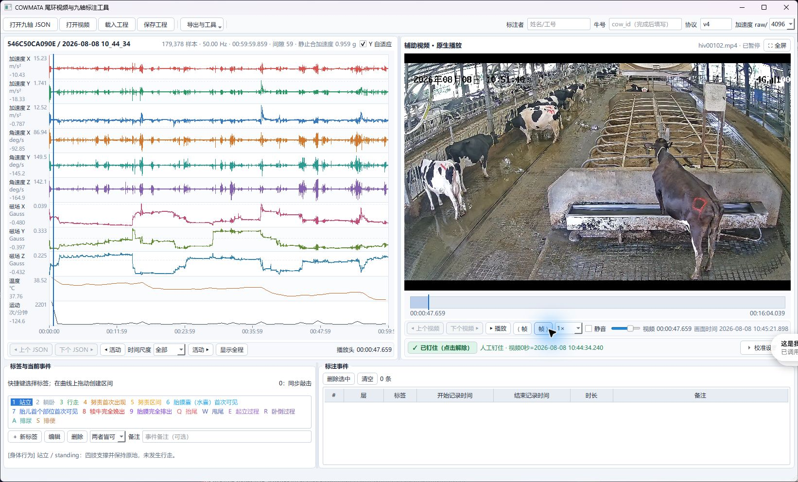
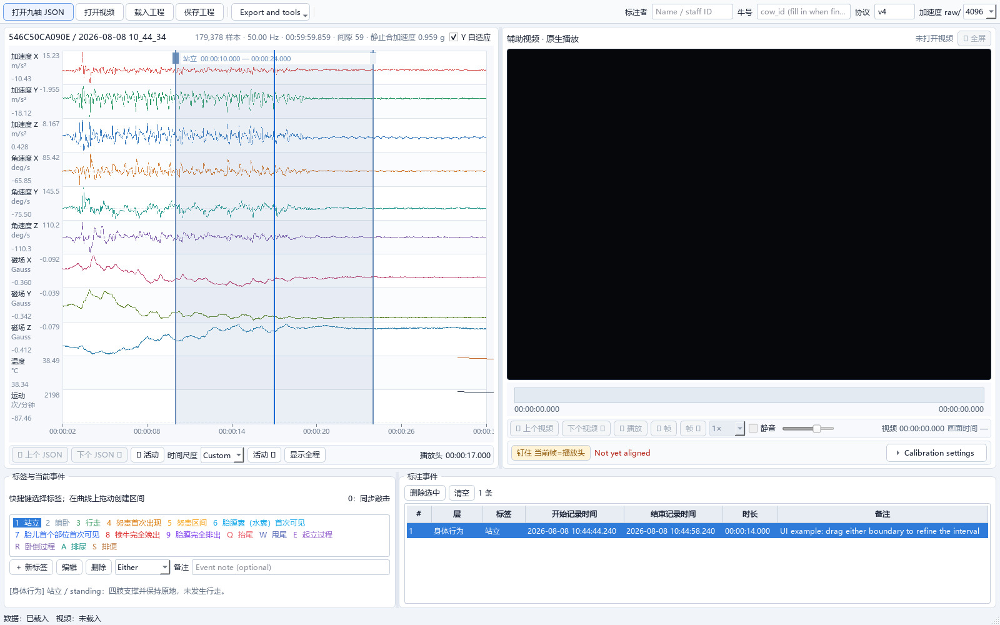
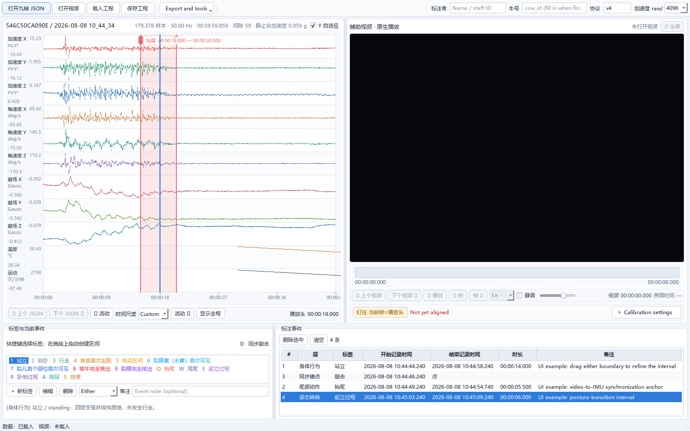

<div align="center">

> **普通用户直接使用离线 EXE：** 到 [Releases](https://github.com/zxq309/cattle-tail-ring-annotator/releases)
> 下载完整离线安装版 **Setup.exe**，按向导安装，无须配置 Python、pip、VLC、CUDA 工具包或模型。
> GitHub 自动生成的 **Source code.zip 是源码，不是可直接运行的软件包**。


# COWMATA 牛尾环标注工具

**面向奶牛行为与分娩研究的人机协同视频—九轴 IMU 标注工作台**

[](https://github.com/zxq309/cattle-tail-ring-annotator/actions/workflows/ci.yml)
[](https://github.com/zxq309/cattle-tail-ring-annotator/releases)
[](https://www.python.org/)
[](#环境要求)
[](LICENSE)

[English](README.md) · [简体中文](README.zh-CN.md) · [项目总览](https://github.com/zxq309/cowmata)

</div>



<p align="center"><sub>真实联调截图：59 分 59.859 秒、179,378 个采样点、50 Hz 九轴记录与奶牛视频同步加载；原始素材仅保留在本地，不上传 GitHub。</sub></p>

## 项目简介

COWMATA 牛尾环标注工具是一款 Windows 桌面工作台，用于同步复核奶牛视频与连续九轴尾环 IMU 数据。它在一个界面内提供共用时间轴、v4 标注协议、安全工程保存、逐条复核和科研数据导出。

### 核心能力

- **视频—九轴共时间轴** —— 播放、定位、缩放并同时检查加速度计、陀螺仪和磁力计九个通道。
- **先对齐、后标注** —— 视频与传感器时间轴完成钉住前，正式标注保持锁定，避免无声错位。
- **内置 v4 协议** —— 16 项行为/分娩标签，另含一个不参与训练的同步锚点。
- **人控模型辅助** —— 模型只生成候选项；未经过人工确认，不会成为正式标签。
- **可追溯输出** —— 稳定机器码、显示名称、绝对时间戳、来源字段与导出前结构校验。
- **中英双语** —— 界面语言仅影响显示，不会改写落盘标签码或历史数据。

## 标注示例

<table>
  <tr>
    <td width="50%" align="center">
      <br>
      <strong>区间边界复核</strong><br>
      <sub>选中区间同步覆盖九个通道，起止边界可拖动调整，并在事件表中保留可追溯记录。</sub>
    </td>
    <td width="50%" align="center">
      <br>
      <strong>v4 多层标签示例</strong><br>
      <sub>身体状态、尾部动作、姿态转换与同步点可以共存于同一绝对时间轴。</sub>
    </td>
  </tr>
</table>

> [!NOTE]
> 两图使用真实 50 Hz 波形渲染器；其中标签与备注仅为界面功能演示，不代表该原始记录的科研真值。可在本地用 `python scripts/capture_readme_screenshots.py <sensor.json>` 复现。

## 环境要求

- Windows 10/11 **64 位 x64**，显卡驱动正常。
- 留出软件解压空间（约 2 GB），以及工程索引和可选缓存空间。
- 默认尝试 GPU 硬件解码，保留软件兼容解码选项；不保证所有显卡、编码和八路高倍速均不卡顿。

纯逻辑源码/测试可跨平台，当前原生录像播放与交付 EXE 面向 Windows。详见 [下载、源码运行与打包说明](docs/windows-distribution.md)。

## 快速开始

### Windows 一键启动

下载完整离线安装版 `COWMATA-...-Setup.exe` → 阅读许可 → 选择新的空软件目录 → 安装 → 启动。以后从开始菜单打开 COWMATA，选择数据工程即可。整个过程不要求联网或配置依赖。便携 ZIP 若提供，仅作备用，不必重复下载。BAT 备用入口保留，但不再安装任何依赖。

新版包含 A/B/C 布局、1–8 路可选视角、GPU 播放、跨小录像续接、原片精确帧回看、离线 RapidOCR PP-OCRv6 medium、20260906 五类版本化候选模型、带完整九轴的单文件标注及独立历史回看。模型结果只是候选，不能自动当作录像真值。操作见 [使用说明](使用说明.txt)。

### 源码开发（普通标注人员不需要）

Git 仓库只放源码、测试和小型必要资源；运行库、权重、录像、原始九轴、缓存和安装包不进入 Git 历史。完整离线工作台开发请按 [开发与构建说明](docs/windows-distribution.md) 配合相同版本 Release 运行库。以下只适用于旧单视频基础模式：自行安装 Python 3.10+ 与 VLC 3.x 后执行。

打开 PowerShell：

```powershell
git clone https://github.com/zxq309/cattle-tail-ring-annotator.git
cd cattle-tail-ring-annotator
python -m venv .venv
.\.venv\Scripts\Activate.ps1
python -m pip install --upgrade pip
pip install -e .
cowmata-annotator --mode basic
```

不依赖命令行入口时，可用等价模块命令：

```powershell
python -m cowmata_tailring --mode basic
```

需要模型辅助复核时：

```powershell
pip install -e ".[model]"
cowmata-annotator --mode model-assist
```

`scripts/` 目录仍保留模型辅助和诊断启动方式；需要查看控制台信息时，运行 `scripts\launch-debug.bat`。

## 工程工作台操作主线

打开现有数据工程目录 → 后台索引九轴设备和录像视角 → 选择设备、牛号及 1–8 路视角 → 核对同步锚点 → 根据原片判定真值并标注原九轴区间 → 导出内置九轴记录的单个标注 JSON。以后可单独打开该 JSON，按记录身份和同步关系找录像，不靠标签文件名。

四路及以上播放同时运行候选模型时，主路优先保护交互；辅路明确标为预览，不能作为当前真值。暂停后各路核对原片精确帧。详见 [GPU 与打包说明](docs/windows-distribution.md) 和 [OCR 改进说明](docs/ocr-lightweight-integration.md)。

以下单视频例子、快捷键与旧模型包约定用于兼容 `--mode basic` / `--mode model-assist`；EXE 默认打开的是工程工作台。

## 使用示例

把自己的九轴 JSON 和对应视频放入本地 `examples/` 目录，然后在启动时一次性打开：

```powershell
cowmata-annotator --mode basic --lang zh `
  --json "examples\2026-08-08 10_44_34.json" `
  --video "examples\hiv00102.mp4"
```

本次截图使用的视频为 256 MiB，九轴 JSON 约 5 MiB，二者均已通过 `.gitignore` 排除，不会上传 GitHub。具体见 [examples/README.md](examples/README.md)。

## 使用指南

1. **打开九轴 JSON** —— 核对采样数、频率、时间范围、缺口与九通道真实波形。
2. **打开视频** —— 加载对应录像，并检查工具识别的真实时长。
3. **对齐并钉住** —— 将视频与 IMU 定位到同一可观察事件，再点击“钉住”；完成后才允许正式标注。
4. **创建标签** —— 按标签快捷键；点标签落在当前播放头，区间标签通过拖动波形创建。
5. **复核、保存与导出** —— 校正边界、补充备注、撤销/重做；通过结构校验后保存工程并导出。

工程文件采用原子写入，意外中断不会用半截文件覆盖已有有效工程。

## 快捷键

### 编辑与导航

| 功能 | 快捷键 |
| --- | --- |
| 播放 / 暂停 | `Space` |
| 保存工程 | `Ctrl+S` |
| 撤销 | `Ctrl+Z` |
| 重做 | `Ctrl+Y` 或 `Ctrl+Shift+Z` |
| 删除选中事件 | `Delete` 或 `Backspace` |
| 上一帧 / 下一帧 | `[` / `]` |
| 播放头前后移动 100 ms | `←` / `→` |
| 上一个 / 下一个活动 | `P` / `N` |
| 显示完整信号范围 | `F` |
| 视频全屏 | `F11` 或双击视频 |
| 退出全屏 / 取消待建区间 | `Esc` |
| 校准选中的模型区间 | `Ctrl+E`（模型辅助模式） |

### v4 标签协议

| 快捷键 | 中文标签 | 机器码 | 类型 |
| --- | --- | --- | --- |
| `1` | 站立 | `STANDING` | 区间 |
| `2` | 躺卧 | `LYING` | 区间 |
| `3` | 行走 | `WALKING` | 区间 |
| `4` | 努责首次出现 | `STRAINING_ONSET` | 点 |
| `5` | 努责区间 | `STRAINING_BOUT` | 区间 |
| `6` | 胎膜囊（水囊）首次可见 | `AMNIOTIC_SAC_FIRST_VISIBLE` | 点 |
| `7` | 胎儿首个部位首次可见 | `FETAL_PART_FIRST_VISIBLE` | 点 |
| `8` | 犊牛完全娩出（T0） | `CALF_FULLY_EXPELLED` | 点 |
| `9` | 胎膜完全排出 | `FETAL_MEMBRANES_FULLY_EXPELLED` | 点 |
| `Q` | 抬尾 | `TAIL_RAISED` | 区间 |
| `W` | 甩尾 | `TAIL_WAGGING` | 区间 |
| `E` | 起立过程 | `STANDING_UP` | 区间 |
| `R` | 卧倒过程 | `LYING_DOWN` | 区间 |
| `A` | 排尿 | `URINATION` | 区间 |
| `S` | 排便 | `DEFECATION` | 区间 |
| `D` | 人工辅助产犊 | `MANUAL_CALVING_ASSISTANCE` | 区间 |
| `0` | 同步敲击锚点 | `SYNC_ANCHOR` | 点，不参与训练 |

## 模型辅助复核

模型文件不纳入本仓库版本管理。通过“模型辅助 → 模型包设置…”选择本地目录：

| 文件 | 是否必需 | 用途 |
| --- | --- | --- |
| `gbdt_full.joblib` | 必需 | 六类事件，并提供姿态/行走回退 |
| `best.pt` | 可选 | `OfflineMultiTaskTCN`，负责站立、躺卧与行走 |
| `inference_config.json` | 可选 | 对包外 JSON 提供传感器换算覆盖 |

为保持模型文件兼容，`xgboost` 固定为 `3.2.0`。模型建议导入后状态为“待复核”，会保留原始类别、边界、得分及后续人工修改记录。完整契约见 [模型辅助标注文档](docs/model-assist.md)。

## 输入、工程与导出

| 项目 | 用途 |
| --- | --- |
| 九轴 JSON | 连续加速度计、陀螺仪、磁力计与时间戳数据 |
| 视频 | MP4 及 VLC 支持的其他奶牛录像 |
| 工程 JSON | 对齐关系、源文件、协议、标签、事件、备注与复核状态 |
| 事件 CSV + 元数据 JSON | 含 `label`、`code`、`en` 字段的扁平事件交换格式 |
| 聚合 / BORIS CSV | 兼容点事件与区间事件的汇总格式 |
| 训练样本 CSV | 基于时间戳的多热样本；导出前必须填写真实 `cow_id` |
| IRR CSV | 标注者间一致性报告 |

界面语言不会改写历史数据；`STANDING`、`TAIL_RAISED` 等机器键在中英文会话中保持一致。

## 仓库结构

```text
cattle-tail-ring-annotator/
├── START_ANNOTATOR.bat     # 离线备用入口，不安装任何依赖
├── cowmata_tailring/       # 应用、界面、媒体、标注与推理代码
├── assets/                 # 授权品牌素材与 README 实测截图
├── docs/                   # 使用、模型辅助、架构与打包说明
├── examples/               # 仅本地保留的样例数据说明
├── scripts/                # Windows 与 shell 启动脚本
├── tests/                  # 自动化测试
└── .github/                # CI、Issue 表单与 PR 模板
```

## 开发与验证

```powershell
pip install -e ".[dev]"
ruff check cowmata_tailring tests
pytest -q
python -m cowmata_tailring --version
```

当前分支准备 3.1.0-rc.1；实际发布附件和验收证据见 [Releases](https://github.com/zxq309/cattle-tail-ring-annotator/releases)，2.x 历史记录保留在 [CHANGELOG.md](CHANGELOG.md)。纯源码 CI 有意跳过五项二进制模型包完整性检查，这五项必须在便携包验收中执行。

## 贡献、安全与引用

- 提交 PR 前请阅读 [CONTRIBUTING.md](CONTRIBUTING.md)。
- 安全问题请按 [SECURITY.md](SECURITY.md) 私下报告，不要公开提交 Issue。
- 软件引用信息见 [CITATION.cff](CITATION.cff)。
- 可复现缺陷与边界明确的功能建议请提交到 [GitHub Issues](https://github.com/zxq309/cattle-tail-ring-annotator/issues)。

## 许可证与品牌素材

源代码按 [MIT License](LICENSE) 发布。`assets/brand/` 内的 COWMATA 名称与 Logo 为公司品牌资产，不因 MIT 许可证而重新授权；详见 [NOTICE](NOTICE) 与 [assets/README.md](assets/README.md)。

## 最新更新

**2026-09-07** — 准备 3.1.0-rc.1：离线 EXE、多视角 GPU 播放、内置九轴的历史标注、已核对的 20260906 候选模型及 OCR 轻量改进 v2；保留首页职责精简和历史链接修复。[完整更新记录](CHANGELOG.md)。
