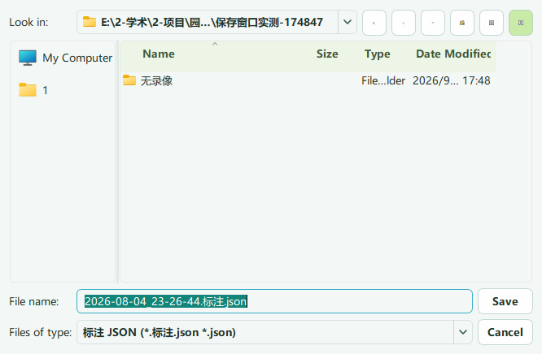

# 3.5.0：单日工程、单文件标注与数据集构建

## 打开工程

菜单和主界面的“打开工程”使用同一流程：先选择并确认牧场根目录，再在一页内选择类别、孕期（仅怀孕）、Motion 和一个日期。类别只读取牧场下一层文件夹；不递归扫描素材。牧场名称不限定，扬大高邮、西农示范基地、盐城大丰等均可使用相同规范。

只加载所选日期九轴和对应 Video；上一日期各视角的末段录像作为跨午夜候选，不把其他日期九轴混入。第一份波形和首路视频优先出现，其余索引在后台继续。已归类视频在文件身份未变化时复用保存的时间轴，变化后重新核验。PPG 保留入口和目录占位，当前不生成脉诊波形。


## 单个文件

- “文件 → 打开九轴”：只打开选定的一份九轴，并查找其日期的 Video 目录。未找到时可以指定该日录像目录，或先仅加载九轴。
- “文件 → 打开单个视频并配对九轴”：先选视频，再选一份九轴；可以位于不同磁盘。只加载这两个选定文件。
- 单文件模式点击“保存”必须选择并确认存放位置；未正式保存的标签在关闭或切换前需要处理。取消选择返回原窗口，标注保留。自动恢复缓存不能代替正式保存。
- 有对应的规范历史标签时可恢复到临时会话中，未确认保存位置前不回写原工程。正式结果与工程标注使用同一 JSON 范式。




## 目录与文件名

```text
牧场/产犊（或其他类别）/
├─ Motion/2026-08-29/设备-耳标-现场号/2026-08-29_17-22-25.json
├─ Video/2026-08-29/视角01/2026-08-29_17-09-27.mp4
├─ PPG/2026-08-29/（预留）
└─ 标注工程/
   ├─ Motion/2026-08-29/设备-耳标-现场号/2026-08-29_17-22-25.标注.json
   └─ PPG/（预留）
```

怀孕分孕早期、孕中期、孕晚期，再进入相同结构。日常标注只保留一套按日期排列的轻量 JSON，不同时维护 annotations 和导出标注两套成果。index.sqlite、writer.lock 和布局标记属于软件索引与写入保护，保留由软件管理。正式标签的上一保存版本放在本机软件恢复目录，不在资源目录产生长尾备份名。

资源中的原始九轴、标注和录像只用起始时间命名到秒；数据内容的精确采样时间保持不变。视频优先流内时间、OCR 复核，失败或冲突状态存索引，不拼进文件名。不同内容发生同名时停止覆盖，要求复核。

## 数据集构建

顶层“数据集构建”位于数据整理和行为识别之间：标签与来源检查、按行为与耳标构建、综合决策构建、按牛划分说明。先保存标注，指定新的输出目录。整个牧场或类别工程使用当前保存的标注；单文件模式使用客户确认保存的标签文件。

```text
数据集/
├─ 原始JSON/23282_0C3D5EA22DDE_2026-08-29_17-22-25.json
├─ 标注/23282_0C3D5EA22DDE_2026-08-29_17-22-25.标注.csv
└─ 行为数据集/躺卧/20225/
   └─ 20225_0C3D5EA22E36_2026-09-01_15-24-22-225.npz
```

原始九轴及其标签表按记录起始时间命名到秒，行为样本按行为起始时间保留毫秒。文件名不附加结束时间、哈希或事件编号。跨记录总索引、校验清单、母标签表和 cow-splits.json 使用固定接口名称，完整身份与校验值保留在文件内容中。

爬跨只取发情、努责只取产犊；其他行为合并所选类别，按耳标区分。同一牛只在一个训练、验证或测试集合；少于三牛不自动划分。未标注不是负例，身份或时间冲突保留待核。五个现有行为算法可勾选导出训练特征；是否能训练以 readiness.json 为准。

工程 JSON 用于继续编辑或回看，数据集标签 CSV 用于算法输入。完整成果、片段和旧接口输出已集中到“数据集构建 → 标注分享与片段”。日常轻量标签与原始 Motion 一起复制；如需单文件独立携带波形，使用“完整成果”或“所选片段”。一次性旧标签迁移入口已撤下。
