# COWMATA Annotator 新手图文操作手册 3.3.0

操作顺序：准备数据 → 审查归类 → 标注保存 → 复核导出。

截图由当前 3.3.0 软件实际运行取得。牛舍录像为授权短片；九轴、绑定、类别和标签为隔离演示数据，不作研究真值。

## 01 安装 3.3.0

阶段：开始使用

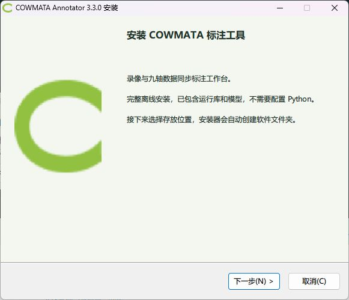

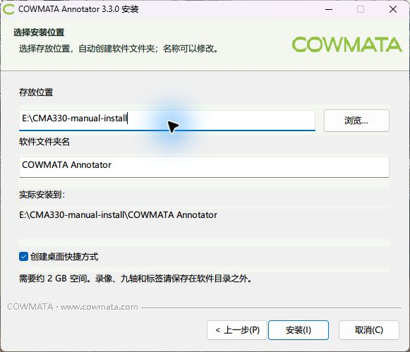

1. 下载发布页最新的 3.3.0 安装包，双击运行。
2. 选择软件目录，按安装向导完成；原始数据放在单独的数据目录。
3. 已有工程可继续打开；没有更新器的旧版先手动安装这一版。

只安装最新版，无须依次安装中间版本。

## 02 启动检查与强制更新

阶段：开始使用

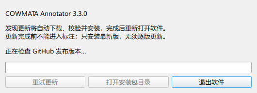

1. 启动时先联网检查最新版本，检查通过后才能进入工作台。
2. 发现更新会自动下载、校验并安装；更新完成后重新打开。
3. 失败时选择重试或退出；已打开的工程可继续离线标注。

运行中的后台检查设置，不会关闭下次启动的强制检查。

## 03 先准备来源，再整理数据

阶段：准备数据

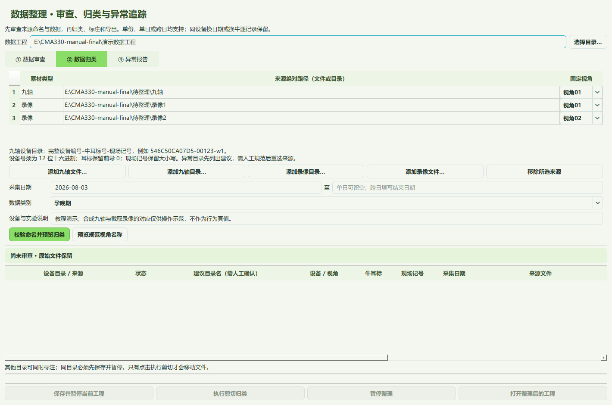

1. 打开“数据整理 → 数据归类”，选择目标数据工程。
2. 添加九轴文件或根目录；每路录像分别添加，并指定视角01至视角08。
3. 支持单个设备、单份记录、单日或多日。确认采集日期，先选类别再审查。

文件夹可嵌套；新归类会展开到日期目录。视角名称与摄像机品牌无关。

## 04 九轴目录必须写对三段

阶段：准备数据

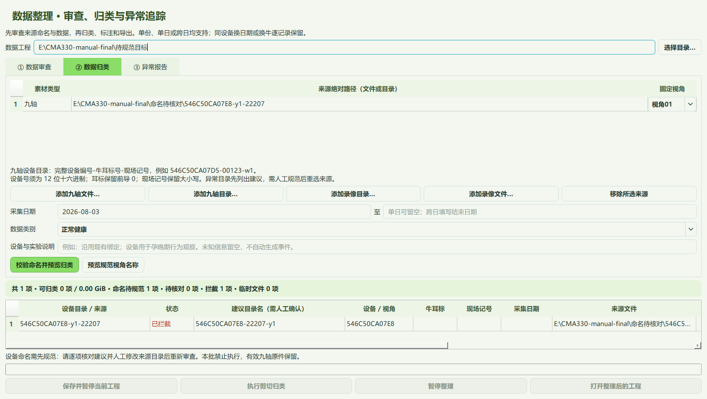

1. 目录格式：完整设备编号-牛耳标号-现场记号，例如 546C50CA07D5-00123-w1。
2. 设备号为12位十六进制；耳标只用数字并保留前导0；现场记号限英文字母/数字，保留大小写。
3. 看到“命名待规范”先核对建议，人工改好来源目录后重选。工具不会猜牛号或自动改名。

同一设备换日期、换牛可以复用；每条记录分别保留身份。已有工程不强制迁移目录。

## 05 选择本批数据类别

阶段：准备数据

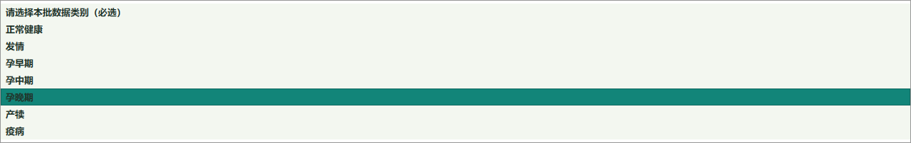

1. 按现场已确认信息选择：正常健康、发情、孕早期、孕中期、孕晚期、产犊或疫病。
2. 不同类别分批整理；不会根据日期、波形或行为自动推断孕期。
3. 类别随标签保存与导出；各类别下都可自由标起立、卧倒、抬尾、甩尾、排尿、排便等行为。

“怀孕数据类别”是人工采集背景，不等于算法已识别怀孕。

## 06 先审查，再处理异常

阶段：审查归类

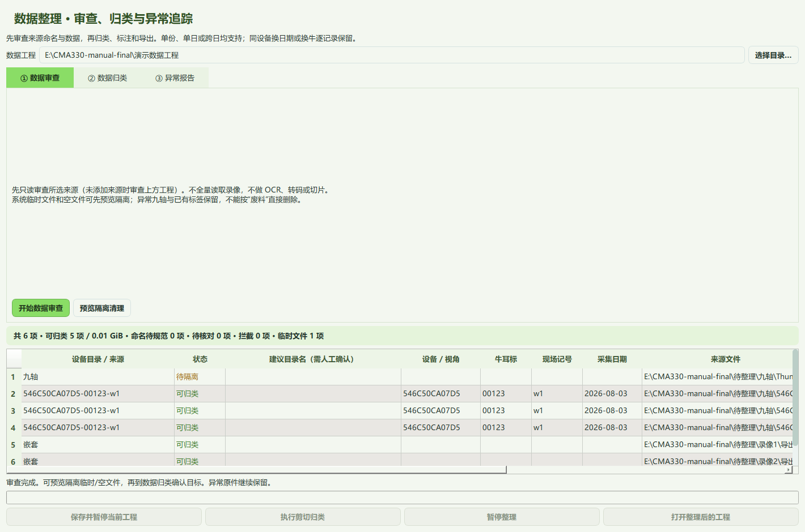

1. 切到“① 数据审查”，点击“开始数据审查”。
2. 检查可归类、命名待规范、待核对和临时文件数量。
3. 需要清理时先点“预览隔离清理”；核对清单后再执行。

有效九轴命名不规范也会保留；已有标签和异常原件不能按废料直接清除。

## 07 异常报告与任务记录

阶段：审查归类

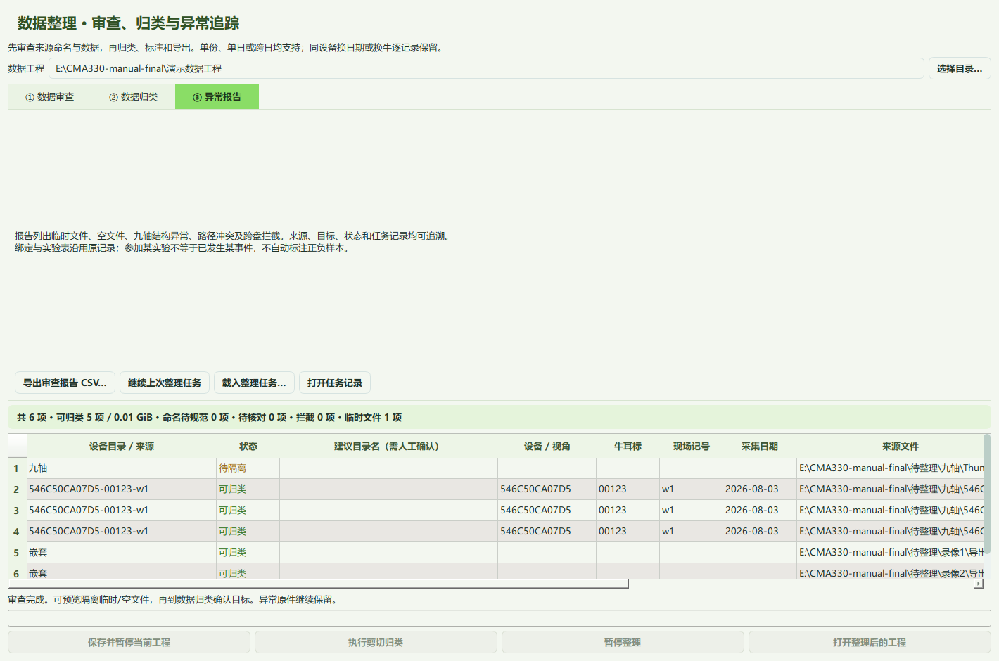

1. 在“③ 异常报告”查看来源、状态和修改建议；横向滚动可看完整列。
2. 导出审查报告 CSV，交给采集人员逐项核对。
3. 暂停或意外中断后，用“继续上次整理任务”或“载入整理任务”恢复。

临时与空文件移到工程外隔离区，任务记录保留去向；不要自行删除任务记录。

## 08 核对归类预览

阶段：审查归类

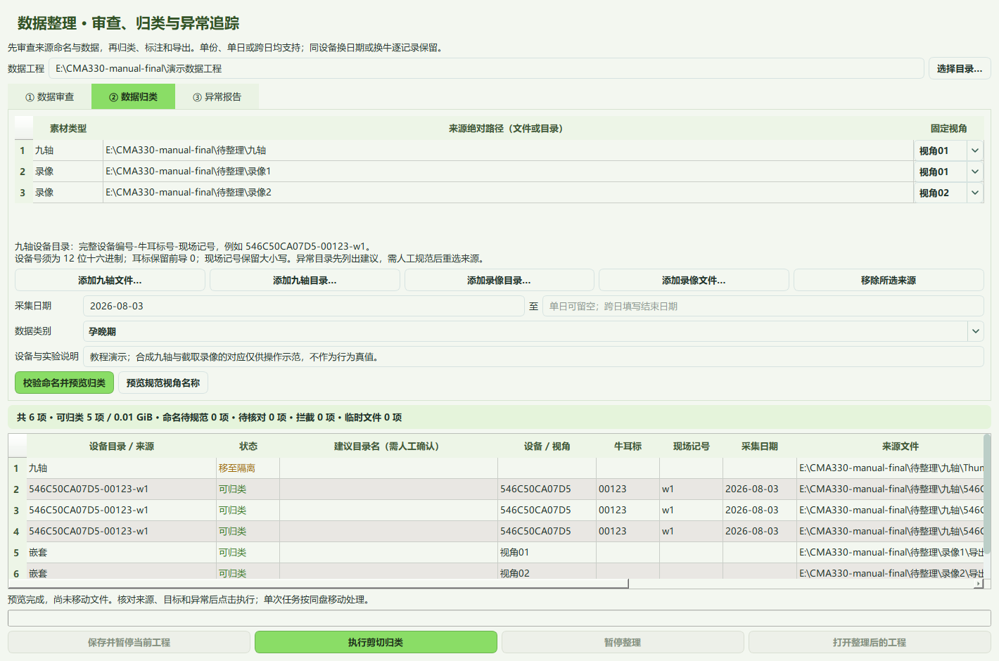

1. 返回“② 数据归类”，点“校验命名并预览归类”。
2. 逐行检查设备、牛耳标、现场记号、实际采集日期和目标路径。
3. 确认无误后点“执行剪切归类”，在确认框中继续。

同盘移动不复制整段录像；跨盘任务会拦截，避免不知情地复制大批素材。

## 09 等整理完成，再打开标注

阶段：审查归类

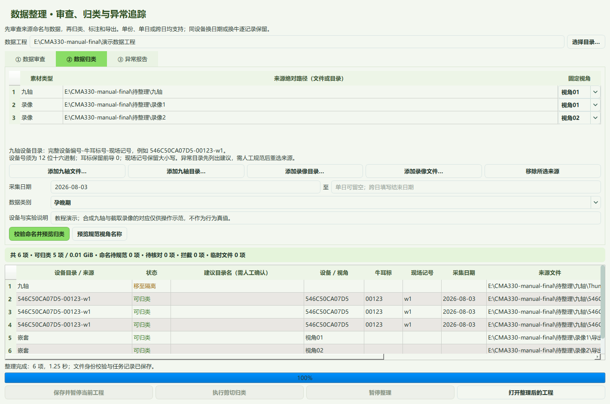

1. 看到“整理完成”与完整进度后，点击“打开整理后的工程”。
2. 整理的目标或来源正被标注占用时，先保存并暂停该工程，再执行整理。
3. 整理其他目录时可同时标注；“暂停整理”会留下可续接的任务。

整理成功会保留分类清单、索引和任务记录；这些是工程资料，不是废料。

## 10 认识标注工作台

阶段：开始标注

1. 左侧选设备与九轴记录，核对牛耳标、现场记号和类别。
2. 当前九轴和匹配录像就绪后会提示“加载成功”；其余记录按需读取。
3. 勾选视角开始观察；顶部可切换“观察、多视角、波形”。

本教程使用真实牛舍录像短片和合成九轴，演示绑定与标签仅用于操作说明，不作研究真值。

## 11 未索引，不等于没有录像

阶段：开始标注

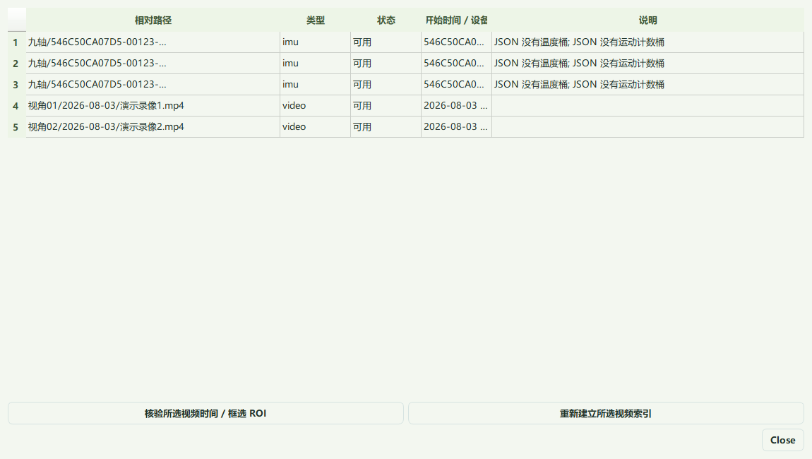

1. 点左下“索引核验”，查看可用、未索引、待复核、异常或缺失状态。
2. 先选要标的九轴；仍未匹配时用“工具 → 录像索引 → 扩大当前检索”。
3. 需要全量处理时启动“完整索引”；右下“加载记录…”可看完整进度与原因。

重新建立索引只更新可重建信息；已有人工标签与校准记录保留。

## 12 加载记录与检索工具

阶段：开始标注

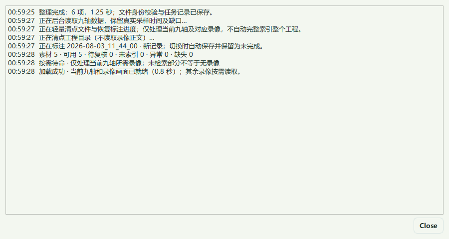

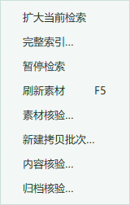

1. 状态栏显示不全时，点右下“加载记录…”查看并复制完整路径、进度与提示。
2. 在“工具 → 录像索引”可扩大当前检索、启动完整索引、暂停检索或刷新素材。
3. 素材改动后再刷新；大批录像的内容核验和完整索引需等待后台完成。

同名新增拷贝可建立唯一批次；不要通过反复复制数据来修复索引。

## 13 时间读错时，核验画面读数

阶段：开始标注

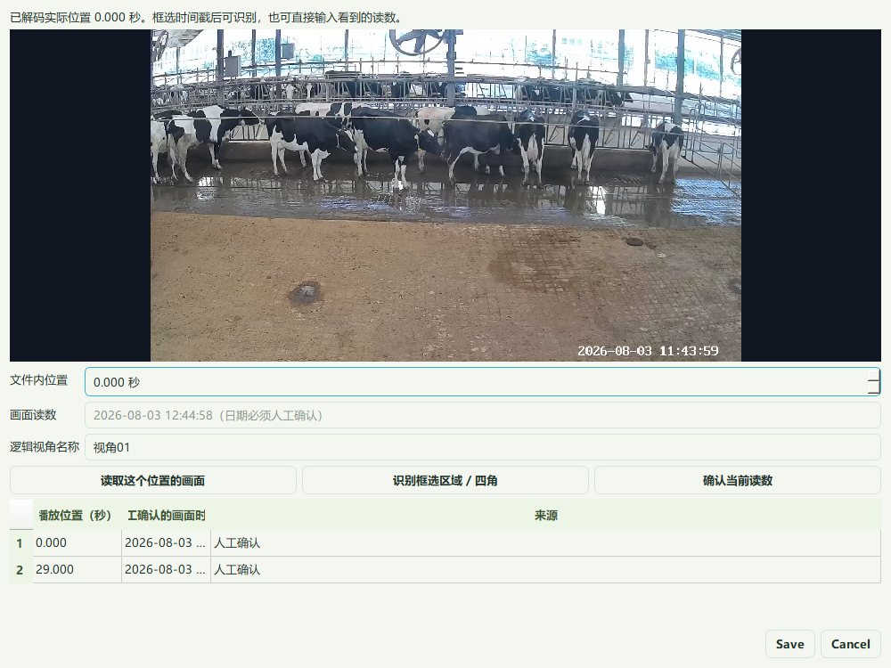

1. 在素材索引里选中录像，点“核验所选视频时间 / 框选 ROI”。
2. 读取画面，框选日期时间区域，识别后人工核对日期与时分秒。
3. 至少确认两个相隔较远的位置，再保存；单个读数只供粗定位。

文件名和编号帮助检索，不作为录像时间真值。

## 14 单路播放、倍速与快定位

阶段：观察与同步

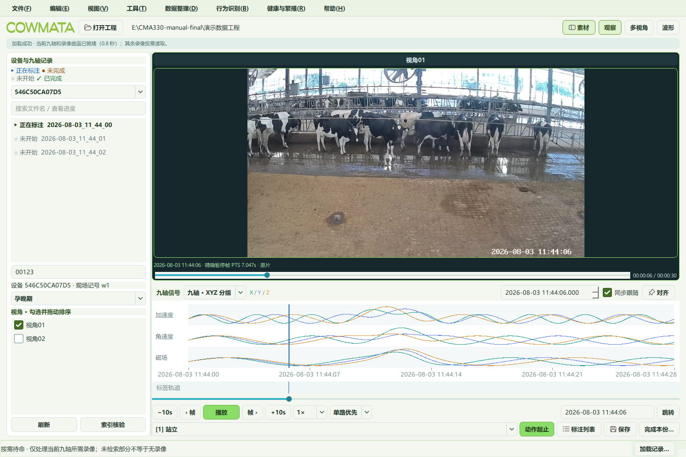

1. 只勾选一个视角，或放大主视角；视频下方有独立播放进度条。
2. 用1×、2×、4×播放观察；拖动进度条或输入日期时间后点“跳转”。
3. 细看动作时暂停，用前后帧按钮定位；等实际画面到位后再标。

多路卡顿时选“单路优先”或“流畅优先”；高倍速性能仍取决于电脑和原片编码。

## 15 多视角交叉核对

阶段：观察与同步

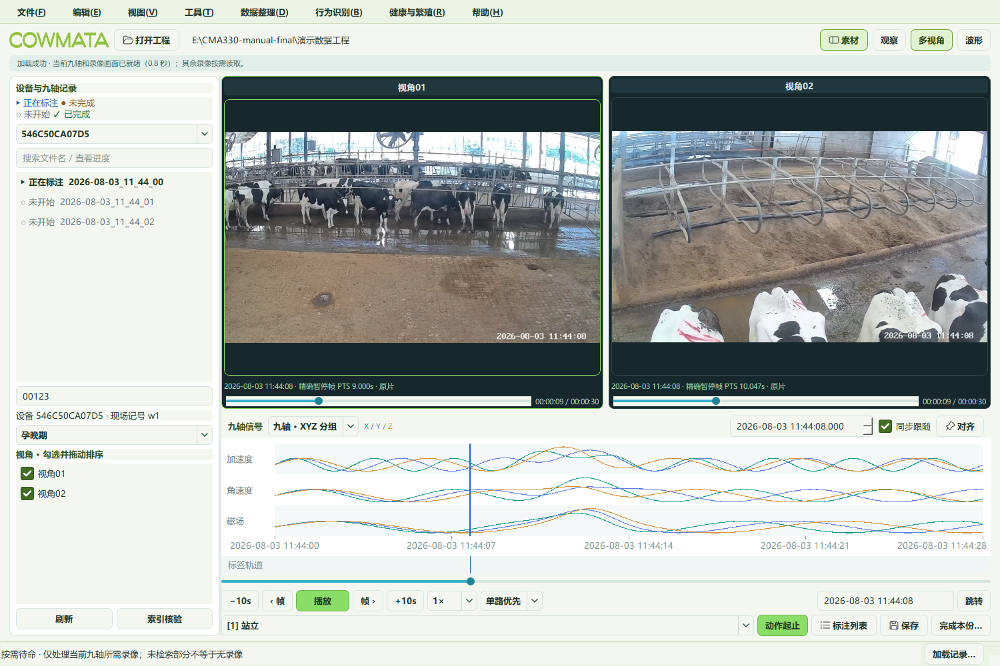

1. 左侧勾选所需视角，最多8路；拖动列表可调整顺序。
2. 顶部点“多视角”看网格；点击画面控件可设主视角或放大。
3. 暂停后核对各路同一参考时刻，避免把遮挡或未就绪的画面当证据。

“多路全速”解码负担更高；切换视角不会自动重建九轴同步关系。

## 16 波形与时间戳

阶段：观察与同步

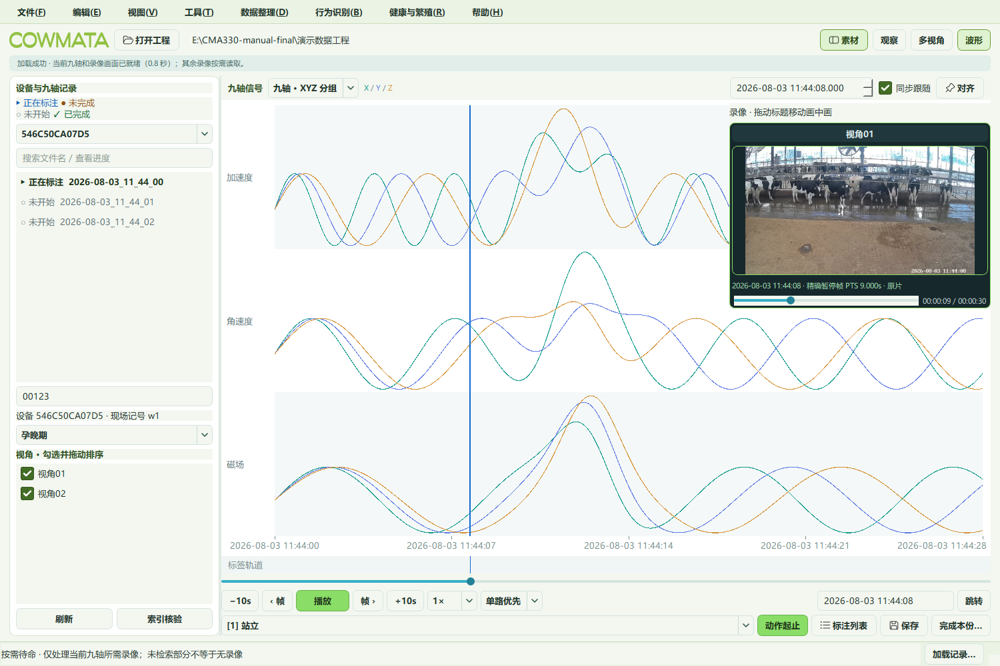

1. 点“波形”放大九轴，视频变为画中画；可拖动调整位置。
2. 九轴横轴和时间输入使用日期时间，便于与视频时间戳查找。
3. 在波形拖选区间供候选或片段导出；按F恢复整份九轴视图。

加速度、角速度和磁场用于辅助观察；波形变化本身不等于已发生某行为。

## 17 人工确认九轴与视频同步

阶段：观察与同步

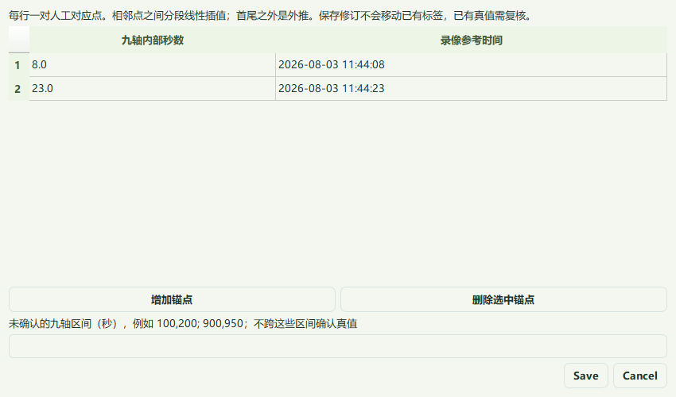

1. 找到同一个明确动作：把九轴光标和暂停视频分别定位到对应时刻，点“对齐”。
2. 在较远的另一个位置再核对并对齐；勾选“同步跟随”一起移动。
3. “工具 → 时间同步 → 九轴校准”可检查对应点；相机有时钟偏差时单独校准相机。

校准表使用九轴内部秒数表示对应点；修改同步后，已有真值需要重新复核。

## 18 先记录动作，再确认真值

阶段：标注与保存

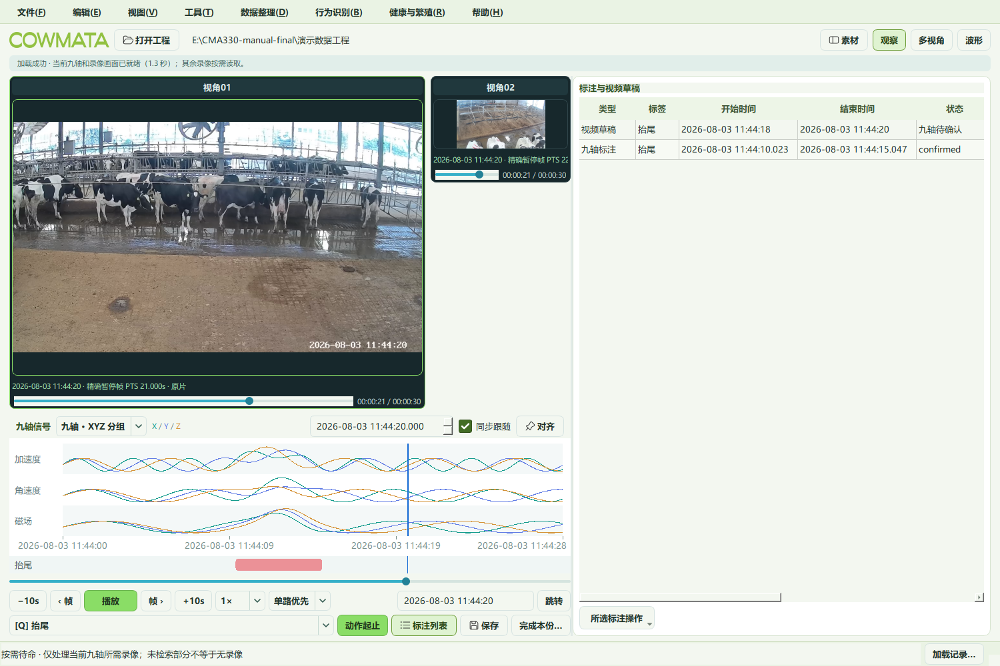

1. 选择标签，点一次“动作起止”记开始，再点一次同标签记结束；点事件只记一次。
2. 点“标注列表”查看视频草稿；草稿会保留，但还不是确认的九轴真值。
3. 核对目标牛、动作边界与同步后，在所选标注操作里点“确认真值”。

模型候选与视频草稿均需人工复核；未观看或未确认的数据不能当成负样本。

## 19 留存每个视角的证据图

阶段：标注与保存

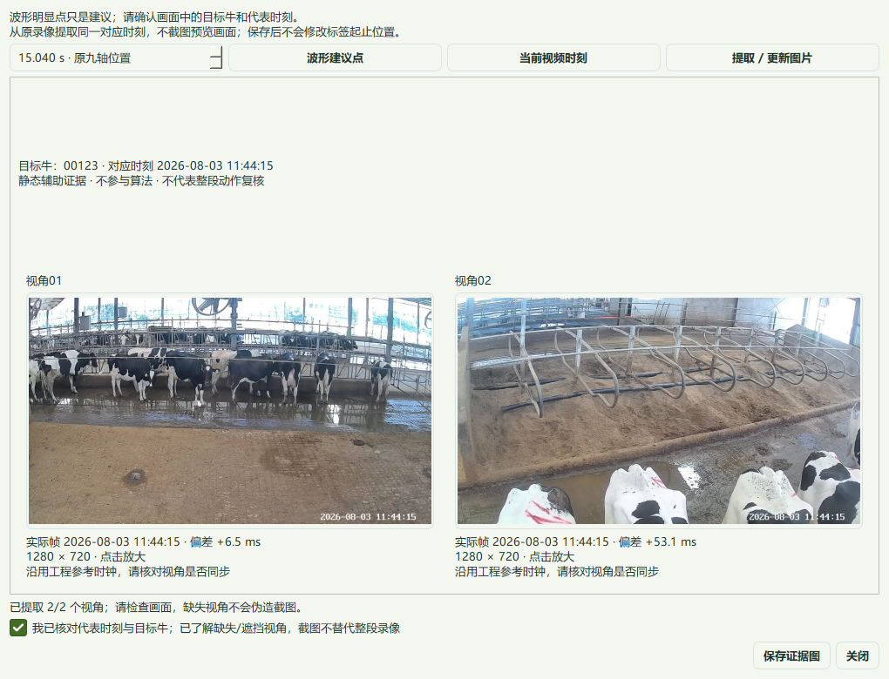

1. 确认真值后打开证据窗口，选择动作内最有代表性的时刻。
2. 点“提取 / 更新图片”，逐一检查目标牛、遮挡和缺失视角。
3. 勾选已核对，点“保存证据图”；导出成果时证据会一并带走。

图片从原录像提取；留存图片不替代整段录像，也不允许凭旧图确认新的动作。

## 20 保存进度，随时继续

阶段：标注与保存

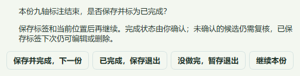

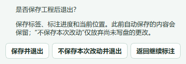

1. 未做完可直接切换记录，工具自动保存标签和位置；回来会恢复进度。
2. 整份检查完后点“完成本份…”：保存并完成，或选择暂存退出。
3. 关闭软件会询问保存；完成状态由你确认，未完成记录继续保留。

左侧颜色区分正在标注、未完成、未开始和已完成。完成整份不代表候选已全部确认为真值。

## 21 标错了可以修改

阶段：标注与保存

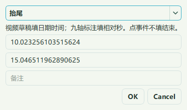

1. 重新打开原工程，选中标注，打开“所选标注操作 → 编辑”。
2. 修改标签、起止边界或备注；也可删除，或用Ctrl+Z撤销、Ctrl+Y重做。
3. 修改后重新回看证据并确认，最后保存；已完成记录可重新标为进行中。

完整成果用于交换；日常继续编辑请打开原标注工程，不要在只读历史窗口中改标签。

## 22 复核后导出成果

阶段：复核与导出

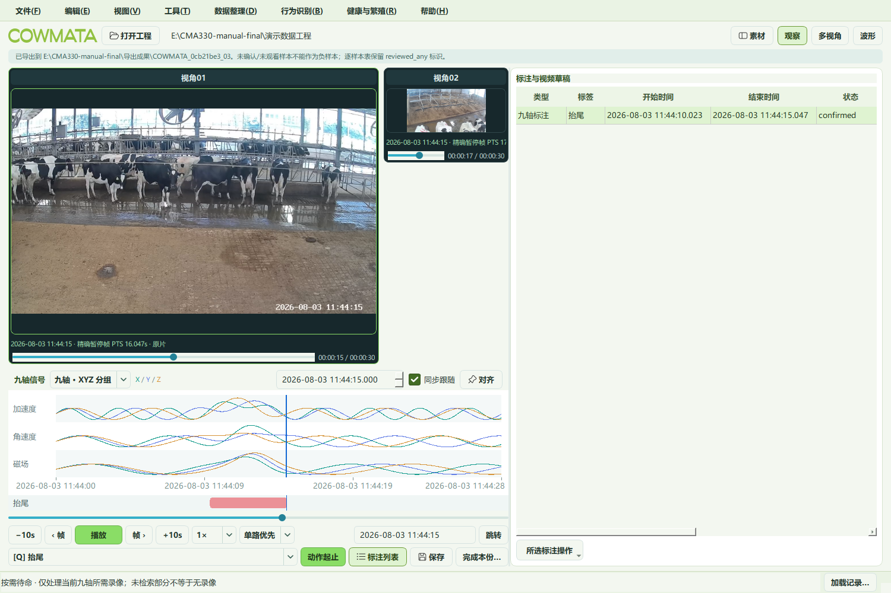

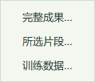

1. “文件 → 导出 → 完整成果”保存当前整份标注 JSON，便于交换和历史回看。
2. 先选九轴区间，再用“所选片段”导出该段数据与标签。
3. “训练数据”导出已确认事件、逐样本标签、BORIS、元数据和完整人工成果。

移动或发送成果时，把同级“证据”文件夹一起带走；类别、牛号与设备记录身份随成果保留。

## 23 历史回看与离线证据

阶段：复核与导出

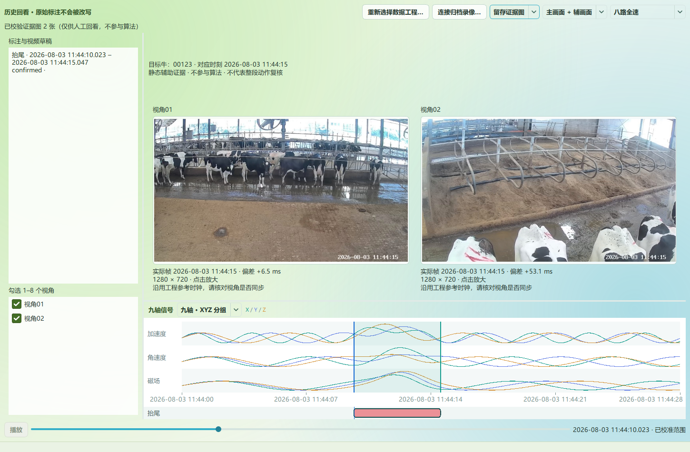

1. “文件 → 历史回看”打开导出的标注 JSON，选择标签定位查看。
2. 有原录像时重新连接数据工程；录像不在本机时切到“留存证据图”。
3. 若已归档录像，可连接并核验归档来源，再继续回看完整动作。

历史窗口只读，不覆盖当前标注；原片缺失与仅有证据图会明确提示。

## 24 多人标注与回传

阶段：复核与导出

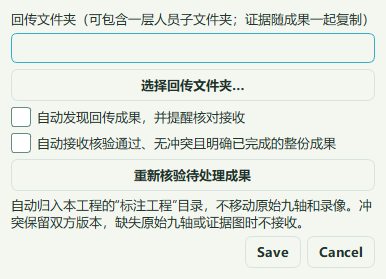

1. “工具 → 多人协作 → 回传设置”选择专用回传文件夹。
2. 将整份标注 JSON 和配套证据放入回传目录，可按人员设一层子目录。
3. 按提醒核对接收；只有明确完成、来源与证据核验通过且无冲突的整份成果可自动接收。

冲突保留双方版本，不覆盖已有人工成果；片段成果不能冒充整份完成。

## 25 行为算法：独立检查

阶段：辅助工具

1. 从“行为识别”选择行为，选单个视角和可用算法版本。
2. 点“运行算法”，双击结果定位九轴与录像，人工判断是否符合动作。
3. “选择对应人工标签”只切换标签类型；需要标注时仍要人工划定动作。

算法结果不自动写入人工标签；没有接入的行为会显示待接入。

## 26 候选预测：逐条复核

阶段：辅助工具

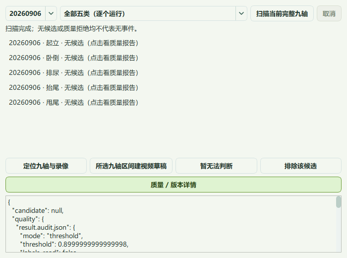

1. “工具 → 事件候选预测”选择版本和模型，扫描当前完整九轴。
2. 选中候选定位录像；可标为暂无法判断，或排除该候选。
3. 需要保留时，在九轴选好实际动作区间后建立视频草稿，再走人工确认流程。

分数不是概率，空结果不是负样本；演示九轴上的运行结果不代表模型实际准确率。

## 27 健康与繁殖的功能边界

阶段：辅助工具

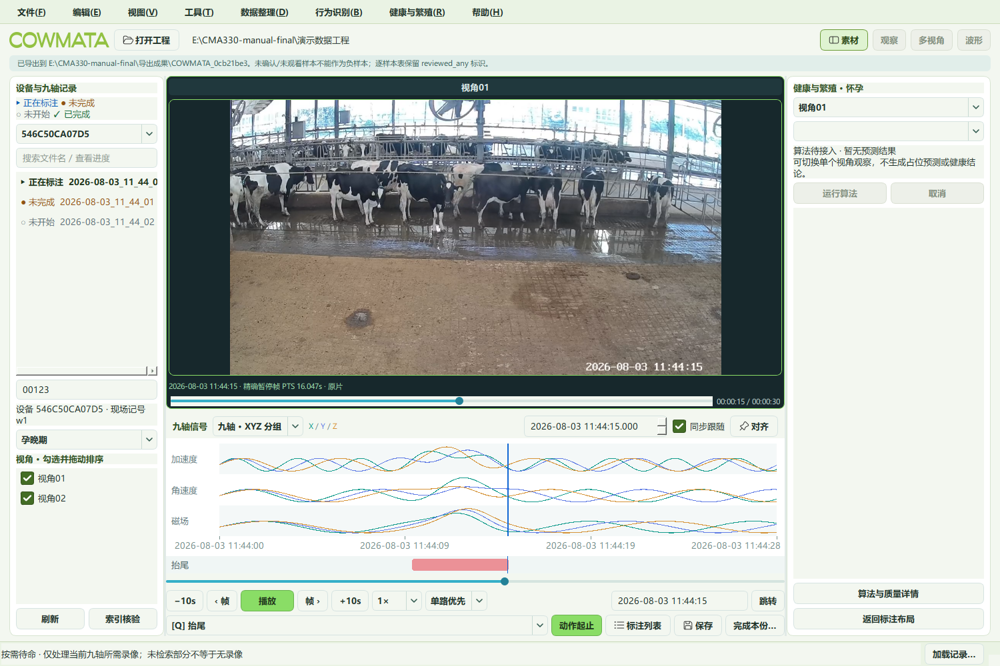

1. “健康与繁殖”中的发情、产犊、怀孕、疫病用于查看对应功能入口。
2. 显示“算法待接入”时不能运行，不会生成占位预测或健康结论。
3. 采集类别仍可手工选孕早期、孕中期、孕晚期等，继续自由标注通用行为。

采集背景、人工行为标签与算法健康结论是不同信息，不互相自动推断。

## 28 界面、播放与性能诊断

阶段：设置与帮助

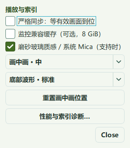

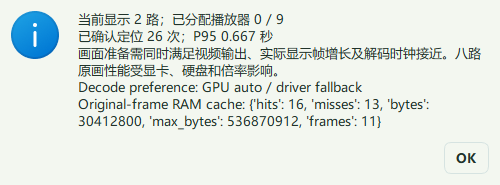

1. “视图 → 界面与播放设置”调整波形高度、画中画大小及位置。
2. 按需勾选严格同步或监控兼容缓存；“视图 → 切换硬件 / 软件解码”在重新打开工程后生效。
3. 播放异常时打开“性能诊断”，记录画面就绪时间、解码偏好与缓存信息。

原始录像不因播放设置被改写；保留原片和故障操作步骤，便于定位问题。

## 29 录像归档核验

阶段：设置与帮助

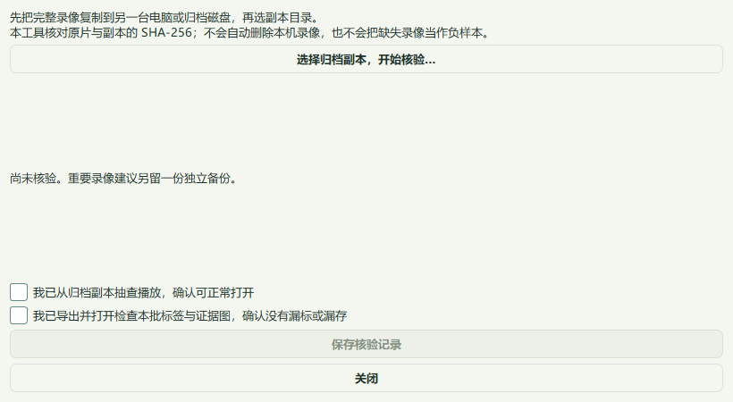

1. 在“工具 → 录像索引”打开“归档核验”。
2. 选择已有录像副本目录，执行核验并保存报告。
3. 核验通过后可用于历史回看；工具不会因归档核验自动删除原片。

保留原录像与已核验副本；缺失或身份不符的副本不能充当确认依据。

## 30 关于、教程和版本更新

阶段：设置与帮助

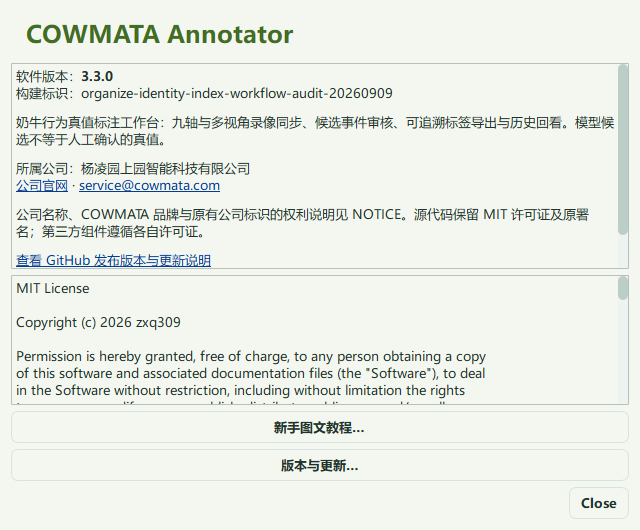

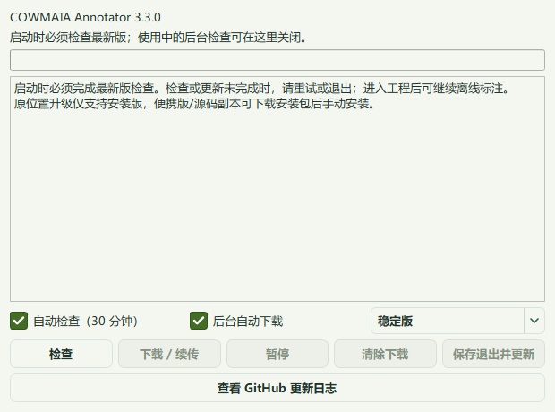

1. “帮助 → 关于”查看版本、构建标识、公司与许可信息。
2. 点“新手图文教程…”打开本手册；帮助菜单也有同一入口。
3. 点“版本与更新…”看最新安装包、下载进度和运行期间的后台检查设置。

启动必须完成最新版本检查；安装版支持原位置自动更新，源码与便携副本需使用安装包。

## 31 快捷键与遇到问题时

阶段：设置与帮助

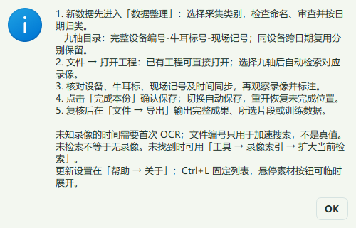

1. Ctrl+O打开工程；Ctrl+J打开九轴；Ctrl+S保存；Ctrl+L固定或收起素材列表。
2. Ctrl+Enter完成本份；Ctrl+PageDown下一份未完成；Ctrl+Shift+O历史回看。
3. F1快速开始；F显示整份波形；F11全屏；Esc退出单路放大。

报错时提供软件版本、具体操作及“加载记录 / 性能诊断”内容；不要先修改原始数据。

## 32 已有工程与旧版兼容

阶段：设置与帮助

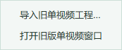

1. 已有3.1或3.2标注工程可从“文件 → 打开工程”继续打开，先保留原工程备份。
2. 仅处理旧单视频标签时，使用“文件 → 旧版兼容 → 导入旧单视频工程”。
3. 导入前核对来源；旧的不明同步关系不会自动沿用，原标签仍需回看确认。

“打开旧版单视频窗口”是兼容入口；本手册常规流程使用当前多视角标注工作台。
