# COWMATA Annotator 新手图文操作手册 3.5.3

操作顺序：准备数据 → 审查归类 → 标注保存 → 复核导出。

3.5.3新增章节使用本次真实界面；通用功能保留历史截图并修订说明。演示标签不作研究真值。

## 01 启动新版与一键实际归类

阶段：3.5.3 实际操作

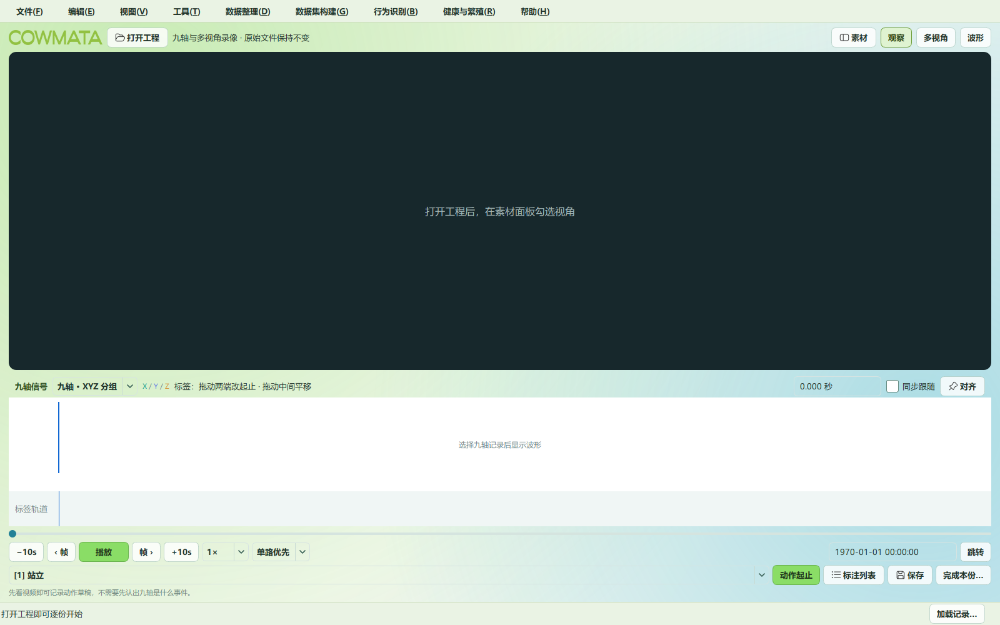

1. 关闭旧版，运行3.5.3安装包，或完整解压便携包后打开COWMATA.exe。
2. 进入“数据整理→数据归类”，选择场景、牧场、类别和保存方式。
3. 点击“一键执行归类”就开始实际处理，无需先完成整批预览。

“仅预览（不复制或移动）”是可选只读操作，不能当作已经归档。

## 02 一次添加多个视角目录

阶段：3.5.3 实际操作

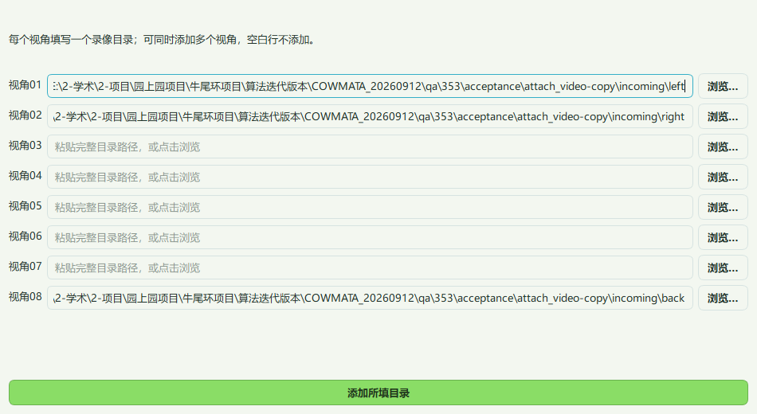

1. 点击“批量添加视角01～08目录”，分别填写各视角的完整路径。
2. 可同时填写多个视角，空白行不添加；同一视角的更多目录可以继续追加。
3. 来源递归进入子文件夹。视频先按后缀筛选，九轴按原始JSON结构识别。

非视频后缀不进入视频识别和列表；九轴、标签按各自规则处理。

## 03 识别一条，实际归档一条

阶段：3.5.3 实际操作

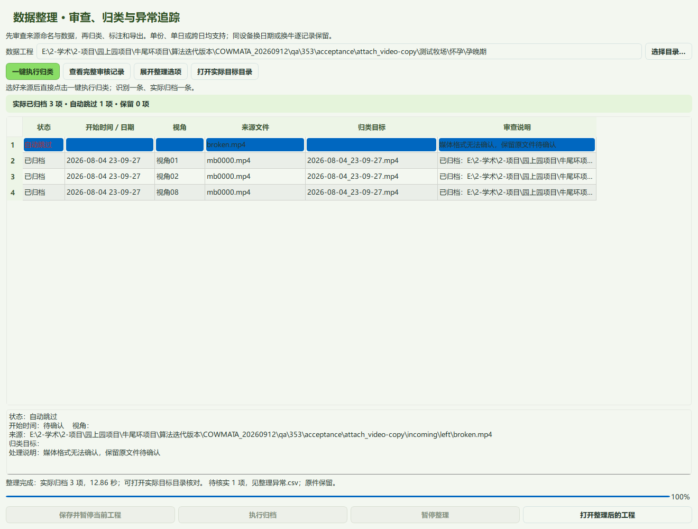

1. 按上方选择直接一键执行，多个视频同时识别，先识别完成的立即传输。
2. “正在写入”表示尚未完成；“已归档”才表示目标文件存在并通过核对。
3. 选择已归档行，点击“打开实际目标目录”查看文件，完整路径在下方记录区。

视频目录为Video/日期/视角01～08/开始时间；不绑定单头牛的设备、耳标或记号。

## 04 首帧不清楚时自动回退

阶段：3.5.3 实际操作

1. 优先读取支持的录像流内绝对时间，没有时再识别开始画面。
2. 首帧读不清会尝试开头约1、2、4秒的画面，扣除媒体偏移回推开始秒。
3. 示例中后续画面显示23:09:28，实际命名开始秒回推为23:09:27。

邻近帧回推为秒级估计，不等于整段同步已核验；始终无可靠时间则保留并自动跳过。

## 05 两种归类场景共用流程

阶段：3.5.3 实际操作

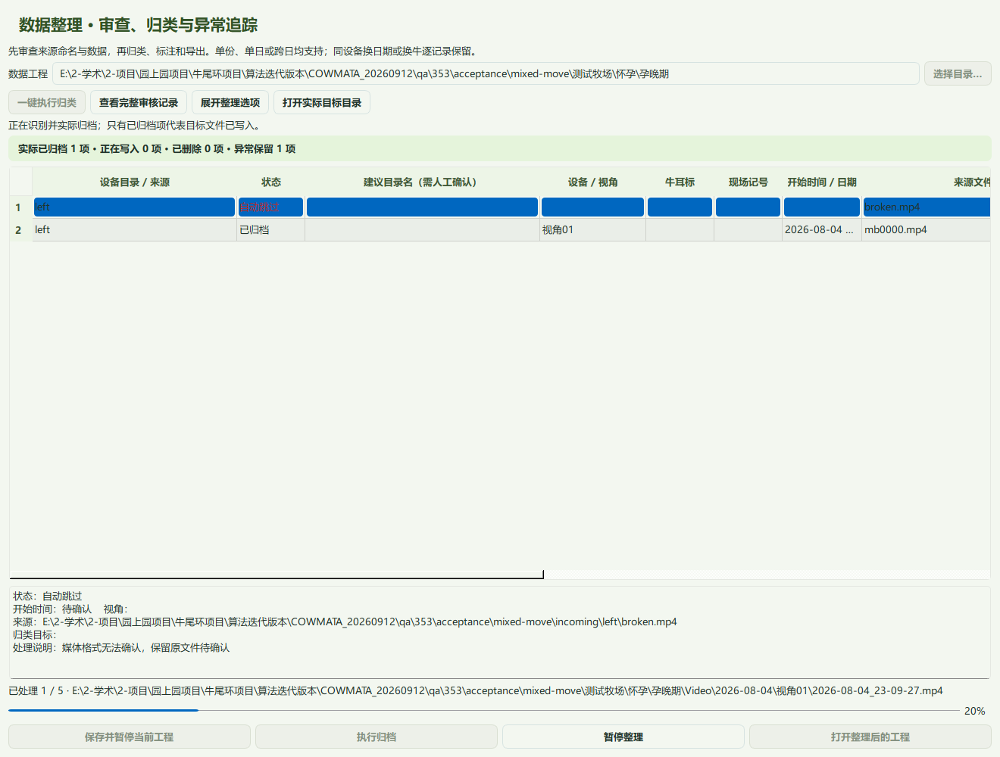

1. 九轴已归类时，仅按已有九轴日期补充全天、多视角录像。
2. 九轴与视频一起整理时，添加两类来源，九轴保持其设备目录规范。
3. 复制保留来源；同盘移动迁移实际文件；跨盘按校验复制保留来源。

九轴改名时同步更新标签引用路径，标注内容保持一致。同名不同内容不覆盖。

## 06 暂停、关闭与恢复任务

阶段：3.5.3 实际操作

1. 暂停后，已完成文件保留；在任务记录中恢复原任务并继续。
2. 关闭数据整理子窗口会停止后台任务，主窗口随后可以正常保存退出。
3. 希望后台继续时可最小化整理窗口；强制停止时未完成临时文件供恢复使用。

不丢弃未保存标签来强行退出；关闭前会保留任务记录，异常原因可在完整记录中查看。

## 07 更新期间看得到进度

阶段：3.5.3 实际操作

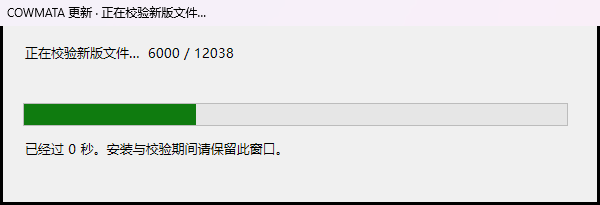

1. 更新退出后会显示独立窗口，报告等待退出、安装、校验和启动等阶段。
2. 校验时显示已检查文件数及经过时间，避免长时间无反馈。
3. 新版校验通过后先启动，再后台清理旧版；更新后这一次启动不重复联网检查。

此图为进度界面演示。旧版更新器的首次迁移不能追溯改变，本次建议直接运行3.5.3安装包。

## 08 加载反馈与离线继续

阶段：3.5.3 实际操作

1. 启动时先显示加载反馈，界面准备好后进入标注工作台。
2. 普通联网检查遇到网络或SSL异常时，可以选择进入软件，继续离线工作。
3. 在“帮助→关于”查看当前版本、更新信息和本完整图文教程。

本机更新后启动界面实测约3秒；磁盘和系统环境不同，不能承诺所有设备固定耗时。

## 09 确认牧场、类别与单日工程

阶段：3.5 完整工作流程（通用功能·历史截图）

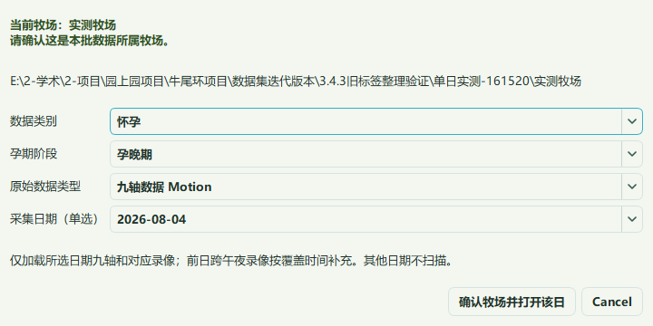

1. 打开工程时先选择牧场根目录，再选择类别和孕期、Motion 及一个采集日期。
2. 只加载当天九轴与对应录像；必要时补入前一天开始、跨午夜覆盖当天的录像。
3. 日常标签保存到“标注工程 / Motion / 日期 / 设备-耳标-现场号”，不再维护两套日常标签。

PPG 当前仍是占位。原始 50 Hz 采样、真实间断与精确时间戳保留。

## 10 单份文件、跨盘配对与保存

阶段：3.5 完整工作流程（通用功能·历史截图）

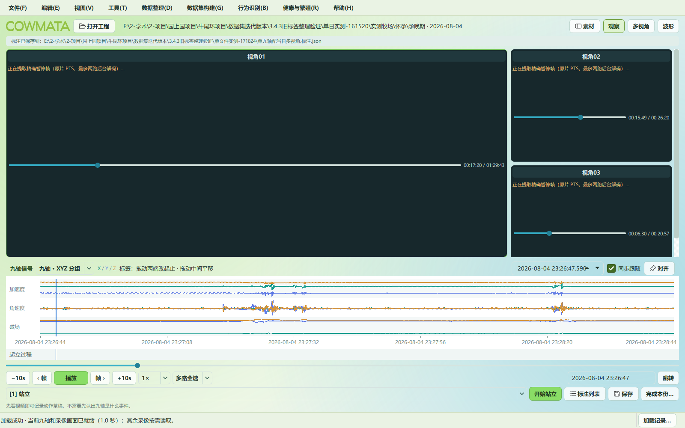

1. 文件菜单选择单个九轴，或选择一个视频并指定配对九轴；支持素材分布在不同磁盘。
2. 单九轴会查找当天对应录像，第一路优先显示，其余视角随后加载。
3. 单文件模式点击保存时，明确选择成果路径；取消选择会保留当前工作，随后仍可保存。

独立分享使用数据集构建中的“标注分享与片段”；保存后可打开成果文件回看。

## 11 人工核验：保存读数后浏览

阶段：3.4.3 六项问题修复（通用功能·历史截图）

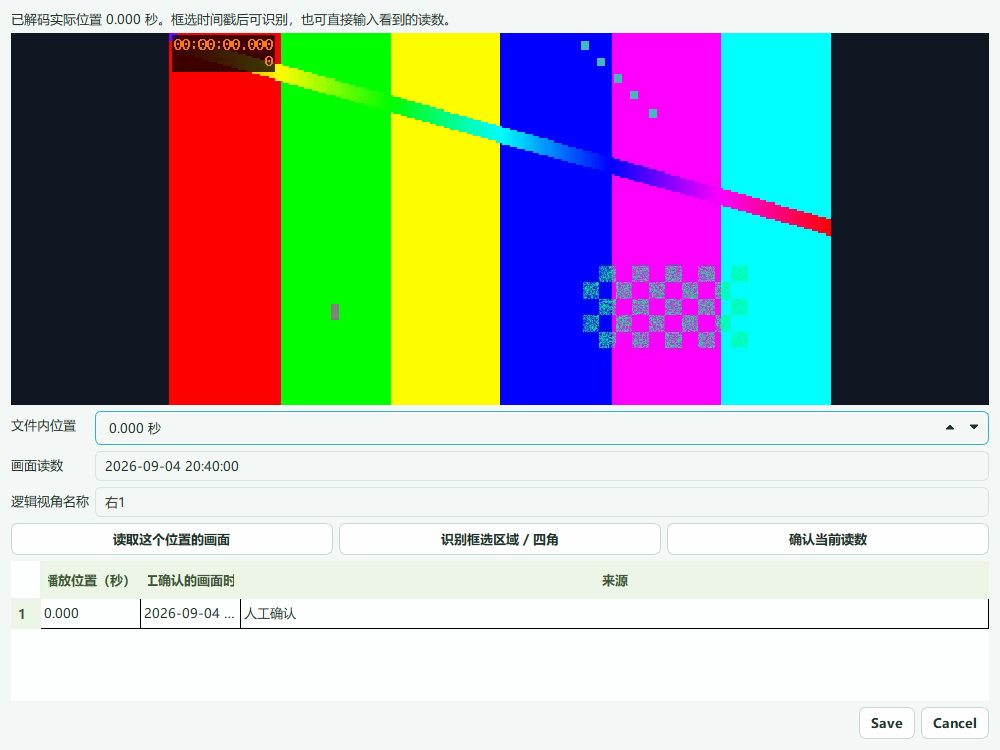

1. 读取实际画面，再填写其日期时间并点击“确认当前读数”；不要把请求位置当成实际帧。
2. 保存一个读数即可粗定位浏览。需要确认区间真值时，在较远位置再核对第二个读数。
3. 保存后播放器立即重新定位，后台索引不会覆盖刚保存的人工结果。

单点外推和双点范围外仍是待核区间，可浏览但不能自动作为已确认视频证据。

## 12 同一路视角与正确文件时长

阶段：3.4.3 六项问题修复（通用功能·历史截图）

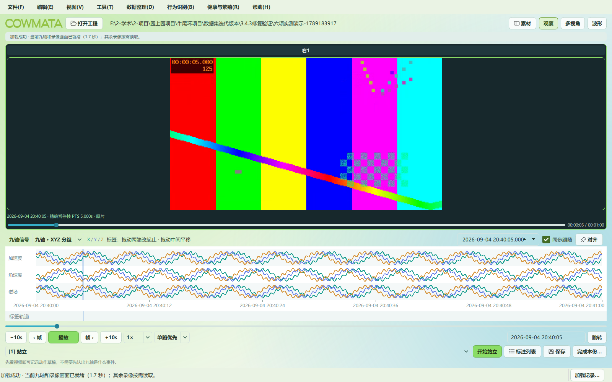

1. 同一路只显示稳定视角名，不再因分辨率或时间戳角落而重复。
2. 画面下方显示文件内位置/完整文件时长，不是已核验片段的长度。
3. 通用播放器误报时长时，可在数据整理菜单另存标准 MP4 副本，原片不变。

标准 MP4 功能仅导出视频画面，音频和私有包保留在原文件。每份按真实流内时间和帧数核对，不预设一小时。

## 13 按时间排查，校准不移动旧标签

阶段：3.4.3 六项问题修复（通用功能·历史截图）

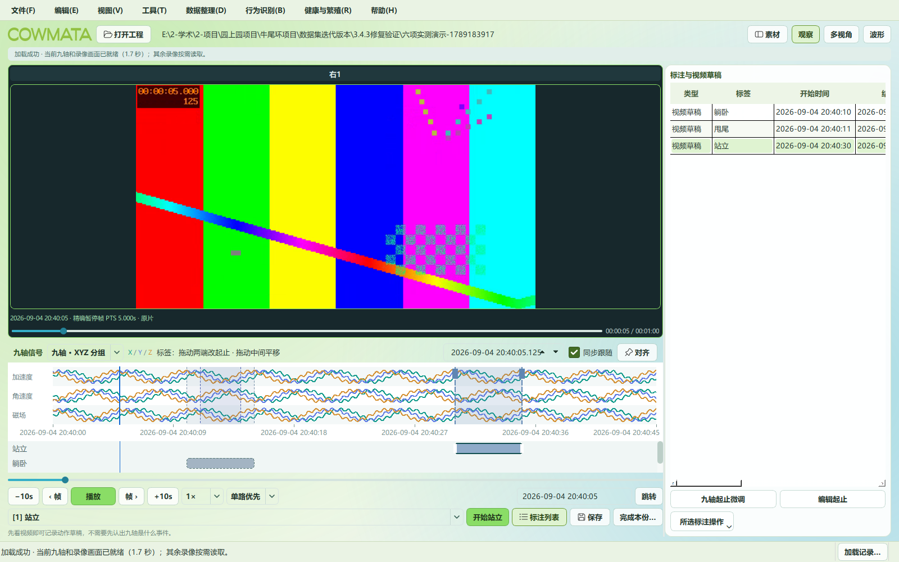

1. 打开标注列表，视频草稿和九轴标签统一按开始时间排序，选中项保持不变。
2. 手动对齐后，已有标签在九轴上的起止位置固定；录像对应关系更新。
3. 受影响标签标为待复核，回看后更新证据；误操作可撤销。

原标注与同步修订历史保留。界面上的绝对时间随校准变化不代表九轴起止被移动。

## 14 站立、躺卧、行走互斥

阶段：3.5.1 行为区间规则（通用功能·历史截图）

1. 三种状态的起点不得放在任何已存在的站立、躺卧、行走区间内；边界可相接。
2. 结束点或整段区间发生冲突时，本次结束不生效；重新定位到合法位置后再结束。
3. 历史遗留的无效起点，可点“取消本次动作”后重标。点事件仍可与状态区间同时记录。

编辑起止、拖动标签或选区标注也检查重叠；已有标签保留，操作可撤销。

## 15 怀孕资料明确选择孕期

阶段：3.4.2 数据归类与算法数据集（通用功能·历史截图）

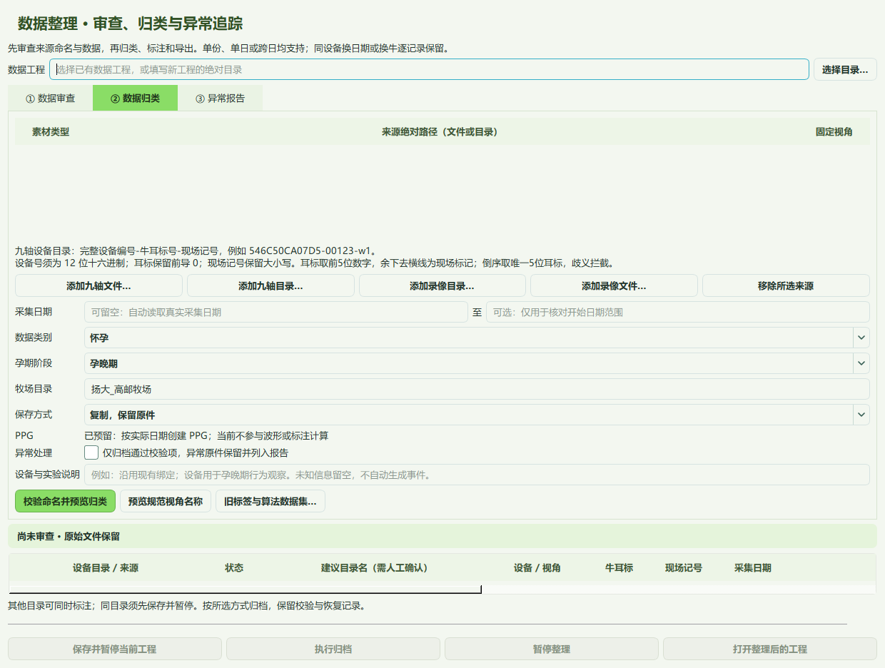

1. 数据整理 → 数据归类，选择怀孕后再选择孕早期、孕中期或孕晚期。
2. 产犊保持一个类别；PPG 目录和字段自动预留。日期按真实采集时间生成。
3. 旧标签整理可直接点击“旧标签与算法数据集”，进入专用迁移窗口。

不能根据行为标签或产犊日期自动推断已有资料的孕期。未确认的旧资料保留原位置。

## 16 先审查旧标签及来源

阶段：3.4.2 数据归类与算法数据集（通用功能·历史截图）

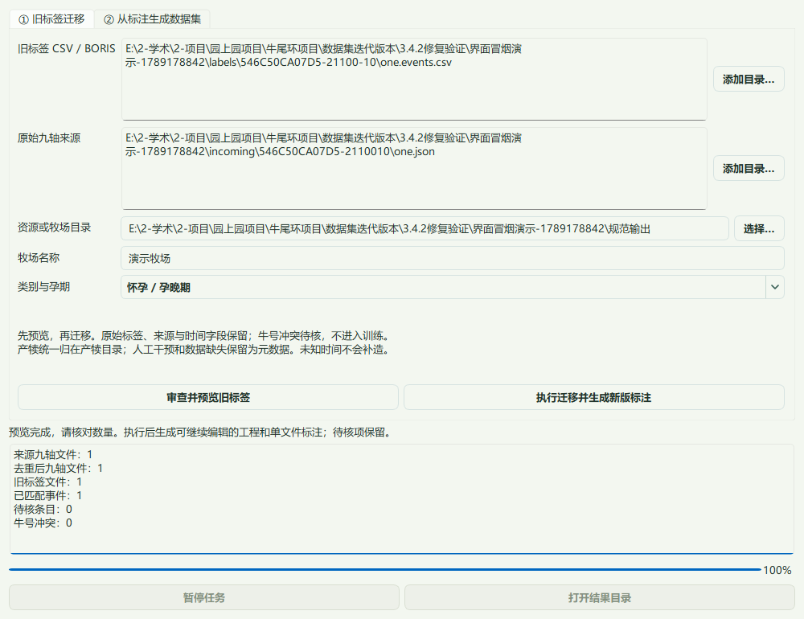

1. 逐行添加旧 CSV/BORIS 标签和原始九轴来源，填写牧场或资源目录及本批类别。
2. 点击“审查并预览旧标签”，核对已匹配事件、未匹配条目和牛号冲突。
3. 有冲突的原行保留待核，不凭目录或别的牛的数据补造身份与时间。

图中采用隔离演示数据测试实际后台任务；不会混入科研数据集。

## 17 迁移为可继续标注的工程

阶段：3.4.2 数据归类与算法数据集（通用功能·历史截图）

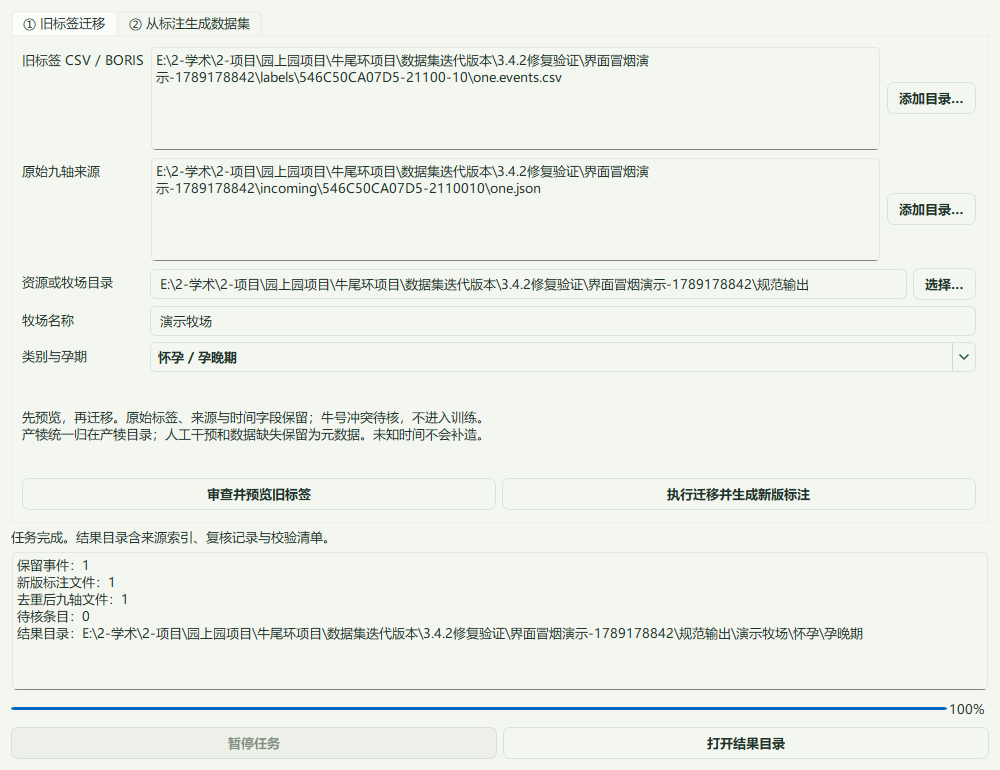

1. 预览确认后执行迁移，完成时会列出保留事件与新版标注文件数量。
2. 标注工程/annotations 保存可编辑成果；导出标注目录保存独立单文件。
3. 点击“打开结果目录”，再通过主窗口打开该类别工程或历史标注。

原始标签、原始九轴与来源哈希保留。修改过的人工成果不能被旧标签覆盖。

## 18 从新旧标注生成算法数据集

阶段：3.4.2 数据归类与算法数据集（通用功能·历史截图）

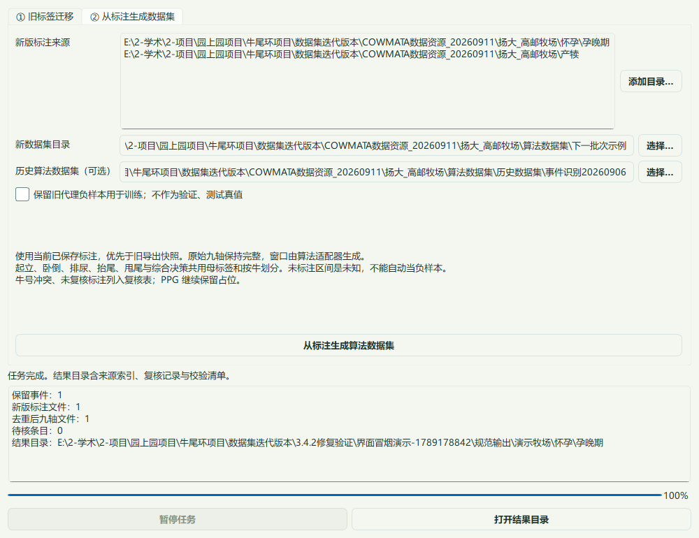

1. Ctrl+S 保存，然后逐行选择类别工程；新数据集目录必须尚不存在。
2. 可选历史事件识别数据集。只有明确沿用旧方案时，才勾选代理负样本仅用于训练。
3. 点击生成；后台完成后按各算法 readiness.json 核对输入条件。

当前标注优先于旧导出快照。同一牛共享划分，未标注不自动等于负例。

## 19 没有九轴也保留真实产犊时刻

阶段：3.4.2 数据归类与算法数据集（通用功能·历史截图）

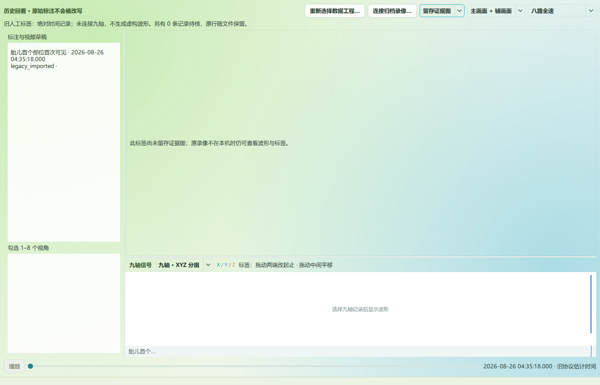

1. 缺少唯一九轴对应的产犊时刻，使用绝对时间单文件保留并可独立回看。
2. 未知时间仅保留原行，不创建虚假的事件、九轴波形或源文件。
3. 完全娩出 T0、露蹄及人工干预分别保留；产犊目录不按引产方式嵌套分类。

此页为本次真实标注的只读回看；无匹配视频或九轴时会如实提示。

## 20 启动便携版与空格播放

阶段：3.4.1 使用与交互（通用功能·历史截图）

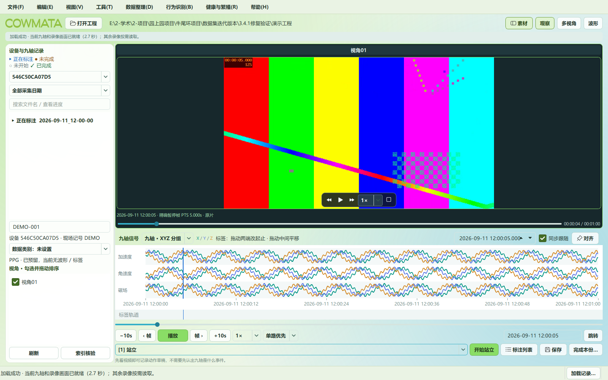

1. 完整解压便携包，双击 COWMATA.exe；启动检查后打开工程。
2. 选择倍速或行为后，无须再点九轴，直接按空格播放或暂停。
3. 牛号、日期、备注等输入框仍可正常输入；下拉列表展开时先完成选择。

请保留整个便携目录及其依赖。截图为生成的演示视频与波形。

## 21 开始与结束不能是同一时刻

阶段：3.4.1 使用与交互（通用功能·历史截图）

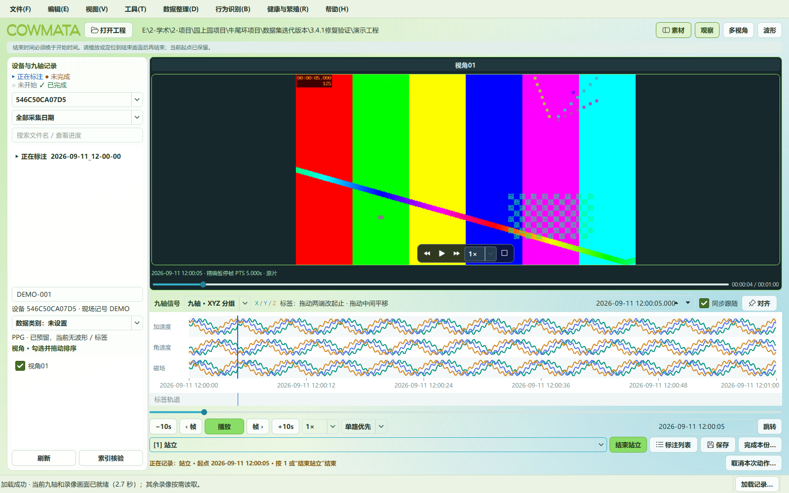

1. 在起点暂停并点击开始；播放、逐帧或跳转到结束画面，再点击结束。
2. 同一时刻重复点击会提示，起点保留，不生成零时长区间。
3. 点事件只记录一个时刻，无须第二次结束。

遇到同帧提示后直接继续播放，无须重新开始动作。

## 22 选中最新标签并直接拖动

阶段：3.4.1 使用与交互（通用功能·历史截图）

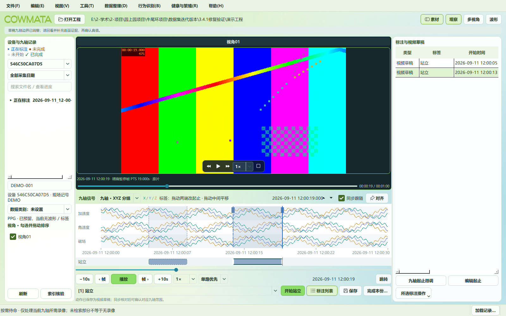

1. 新动作结束后自动选中；拖动轨道两端改起止，中间整体平移。
2. 单击列表或轨道选中后，也可拖动波形上的左右手柄。
3. 调整后回看两端、补充证据并重新确认；Ctrl+Z 可撤销。

只有实际改动才会使已确认标签回到待复核；单击选择不改变确认状态。

## 23 选择对应人工标签：下一步怎么做

阶段：3.4.1 使用与交互（通用功能·历史截图）

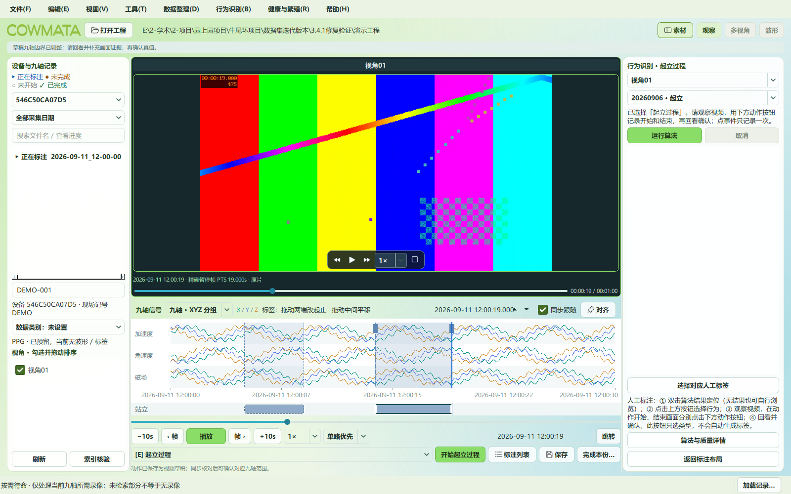

1. 双击算法结果定位；没有结果也可自行浏览视频。
2. 点击选择对应人工标签，下方行为类型和动作按钮随之更新。
3. 观察视频并记录开始、结束；核对后确认。该按钮不会自动生成标签。

算法结果提供定位线索；人工动作区间由用户独立观察确定。

## 24 按批次类别整理新数据

阶段：3.5.3 数据归类

1. 选择牧场、类别、来源和复制或移动方式；多个视角可批量填入。
2. 直接点击“一键执行归类”，完成一条就实际归档一条；仅预览不会写入文件。
3. 任务完成后打开整理后的工程进行标注，已归档文件可以从实际目标目录核对。

未知时间或异常文件保留并自动跳过，不阻断正常项。九轴、标签与视频分别按既定规则处理。

## 25 保存、导出与再检查

阶段：3.4.1 使用与交互（通用功能·历史截图）

1. Ctrl+S 保存工程；文件菜单导出当前成果，保存一个 .标注.json。
2. 历史回看可检查导出成果；修改时回到原工程。
3. 交付时带上证据目录，分别备份原始数据与标注工程。

演示截图中仍未确认的草稿不会自动变为已核验真值。

## 26 先准备来源，再整理数据

阶段：3.5.3 数据归类

1. 选择牧场、类别、来源和复制或移动方式；多个视角可批量填入。
2. 直接点击“一键执行归类”，完成一条就实际归档一条；仅预览不会写入文件。
3. 任务完成后打开整理后的工程进行标注，已归档文件可以从实际目标目录核对。

未知时间或异常文件保留并自动跳过，不阻断正常项。九轴、标签与视频分别按既定规则处理。

## 27 九轴目录必须写对三段

阶段：准备数据（通用功能·历史截图）

1. 目录格式：完整设备编号-牛耳标号-现场记号，例如 546C50CA07D5-00123-w1。
2. 设备号为12位十六进制；耳标只用数字并保留前导0；现场记号限英文字母/数字，保留大小写。
3. 看到“命名待规范”先核对建议，人工改好来源目录后重选。工具不会猜牛号或自动改名。

同一设备换日期、换牛可以复用；每条记录分别保留身份。已有工程不强制迁移目录。

## 28 选择本批数据类别

阶段：3.5.3 数据归类

1. 选择牧场、类别、来源和复制或移动方式；多个视角可批量填入。
2. 直接点击“一键执行归类”，完成一条就实际归档一条；仅预览不会写入文件。
3. 任务完成后打开整理后的工程进行标注，已归档文件可以从实际目标目录核对。

未知时间或异常文件保留并自动跳过，不阻断正常项。九轴、标签与视频分别按既定规则处理。

## 29 可选审查与自动异常处理

阶段：审查归类（通用功能·历史截图）

1. “数据审查”为可选的只读检查，帮助查看九轴结构和目录问题。
2. 视频归类直接一键执行，自动尝试时间回退，异常保留并跳过。
3. 查看完整审核记录或导出报告即可了解原因，不必逐条确认后才处理正常录像。

正式行为标注仍需核对视频真值，不能把自动归类等同于已核验标签。

## 30 异常报告与任务记录

阶段：审查归类（通用功能·历史截图）

1. 在“③ 异常报告”查看来源、状态和修改建议；横向滚动可看完整列。
2. 导出审查报告 CSV，交给采集人员逐项核对。
3. 暂停或意外中断后，用“继续上次整理任务”或“载入整理任务”恢复。

临时与空文件移到工程外隔离区，任务记录保留去向；不要自行删除任务记录。

## 31 核对归类预览

阶段：3.5.3 数据归类

1. 选择牧场、类别、来源和复制或移动方式；多个视角可批量填入。
2. 直接点击“一键执行归类”，完成一条就实际归档一条；仅预览不会写入文件。
3. 任务完成后打开整理后的工程进行标注，已归档文件可以从实际目标目录核对。

未知时间或异常文件保留并自动跳过，不阻断正常项。九轴、标签与视频分别按既定规则处理。

## 32 等整理完成，再打开标注

阶段：3.5.3 数据归类

1. 选择牧场、类别、来源和复制或移动方式；多个视角可批量填入。
2. 直接点击“一键执行归类”，完成一条就实际归档一条；仅预览不会写入文件。
3. 任务完成后打开整理后的工程进行标注，已归档文件可以从实际目标目录核对。

未知时间或异常文件保留并自动跳过，不阻断正常项。九轴、标签与视频分别按既定规则处理。

## 33 认识标注工作台

阶段：开始标注（通用功能·历史截图）

1. 左侧选设备与九轴记录，核对牛耳标、现场记号和类别。
2. 当前九轴和匹配录像就绪后会提示“加载成功”；其余记录按需读取。
3. 勾选视角开始观察；顶部可切换“观察、多视角、波形”。

本教程使用真实牛舍录像短片和合成九轴，演示绑定与标签仅用于操作说明，不作研究真值。

## 34 待确认是什么意思，下一步怎么做

阶段：开始标注（通用功能·历史截图）

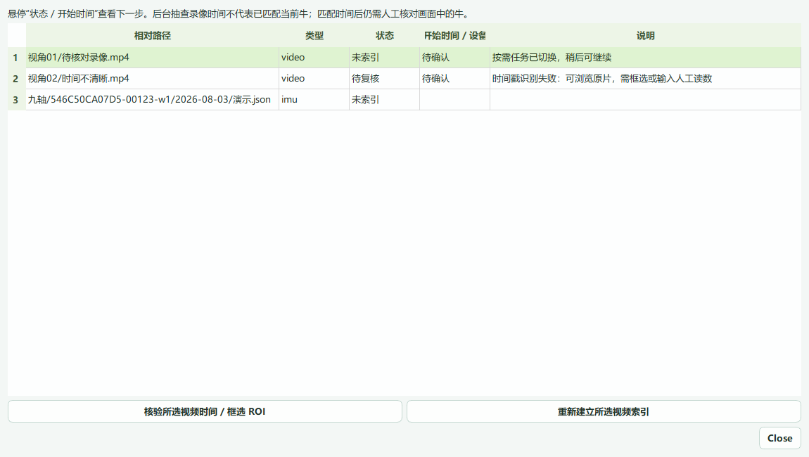

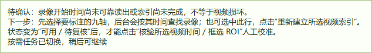

1. 点“索引核验”，悬停状态或开始时间，查看原因与下一步。
2. “待确认”是录像时间未确认，不等于损坏；先选择九轴，或选录像重建索引。
3. 状态变为可用／待复核后，点“核验所选视频时间 / 框选 ROI”，核对画面时间。

本页指正式标注同步的待确认；视频归类中的未识别文件会自动跳过，不要求逐项确认。

## 35 加载记录与检索工具

阶段：开始标注（通用功能·历史截图）

1. 状态栏显示不全时，点右下“加载记录…”查看并复制完整路径、进度与提示。
2. 在“工具 → 录像索引”可扩大当前检索、启动完整索引、暂停检索或刷新素材。
3. 素材改动后再刷新；大批录像的内容核验和完整索引需等待后台完成。

同一时间范围不会因保存或位置刷新从头重识别；难读画面会保留待复核，继续检查其他录像。

## 36 时间读错时，核验画面读数

阶段：开始标注（通用功能·历史截图）

1. 在素材索引里选中录像，点“核验所选视频时间 / 框选 ROI”。
2. 读取画面，框选日期时间区域，识别后人工核对日期与时分秒。
3. 至少确认两个相隔较远的位置，再保存；单个读数只供粗定位。

文件名和编号帮助检索，不作为录像时间真值。

## 37 单路播放、倍速与快定位

阶段：观察与同步（通用功能·历史截图）

1. 只勾选一个视角，或放大主视角；视频下方有独立播放进度条。
2. 用1×、2×、4×播放观察；拖动进度条或输入日期时间后点“跳转”。
3. 细看动作时暂停，用前后帧按钮定位；等实际画面到位后再标。

暂停首帧显示后会后台准备播放；首次完成后复用。异常音轨只在缓存中跳过，原片保留。

## 38 多视角交叉核对

阶段：观察与同步（通用功能·历史截图）

1. 左侧勾选所需视角，最多8路；拖动列表可调整顺序。
2. 顶部点“多视角”看网格；点击画面控件可设主视角或放大。
3. 暂停后核对各路同一参考时刻，避免把遮挡或未就绪的画面当证据。

“多路全速”解码负担更高；切换视角不会自动重建九轴同步关系。

## 39 波形与时间戳

阶段：观察与同步（通用功能·历史截图）

1. 点“波形”放大九轴，视频变为画中画；可拖动调整位置。
2. 九轴横轴和时间输入使用日期时间，便于与视频时间戳查找。
3. 在波形拖选区间供候选或片段导出；按F恢复整份九轴视图。

加速度、角速度和磁场用于辅助观察；波形变化本身不等于已发生某行为。

## 40 人工确认九轴与视频同步

阶段：观察与同步（通用功能·历史截图）

1. 找到同一个明确动作：把九轴光标和暂停视频分别定位到对应时刻，点“对齐”。
2. 在较远的另一个位置再核对并对齐；勾选“同步跟随”一起移动。
3. “工具 → 时间同步 → 九轴校准”可检查对应点；相机有时钟偏差时单独校准相机。

校准表使用九轴内部秒数表示对应点；修改同步后，已有真值需要重新复核。

## 41 先记录动作，再确认真值

阶段：标注与保存（通用功能·历史截图）

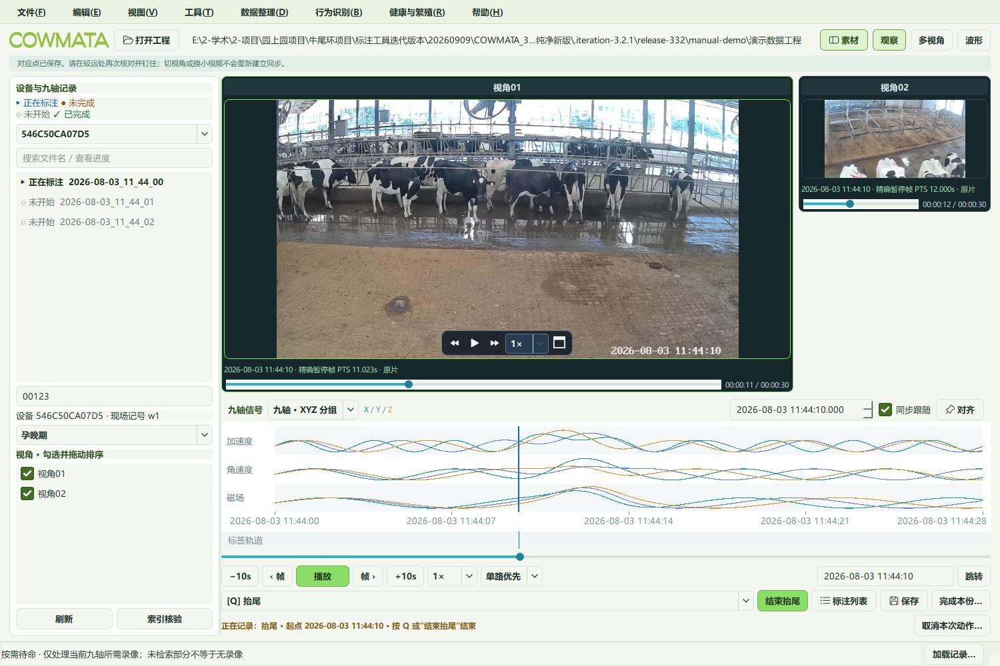

1. 选择行为，点击“开始…”记录起点，再点“结束…”记录终点；同一数字键也可操作。
2. 正在记录的动作名称、起点和结束键始终显示；误操作可点“取消本次动作…”并确认。
3. 打开标注列表查看视频草稿。草稿需调整边界、回看证据并确认，才成为真值。

模型候选与视频草稿均需人工复核；未观看或未确认的数据不能当成负样本。

## 42 在九轴上分别微调动作两端

阶段：标注与保存（通用功能·历史截图）

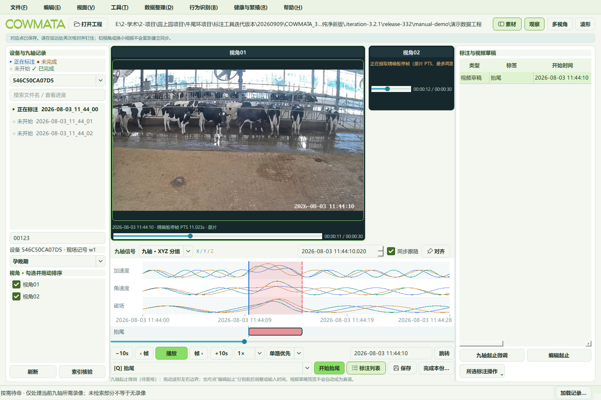

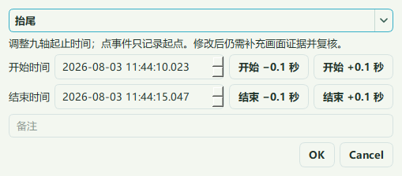

1. 闭合动作区间自动显示淡色背景；在标注列表选中草稿，点“九轴起止微调”。
2. 拖动波形左、右边界；“编辑起止”可分别 ±0.1 秒调整，或直接输入时间戳。
3. 回看调整后的起点、终点，补充画面证据并确认真值，最后保存。

虚线边界为待确认草稿，实线为已确认标签；颜色只帮助看范围，不自动确认为真值。

## 43 留存每个视角的证据图

阶段：标注与保存（通用功能·历史截图）

1. 确认真值后打开证据窗口，选择动作内最有代表性的时刻。
2. 点“提取 / 更新图片”，逐一检查目标牛、遮挡和缺失视角。
3. 勾选已核对，点“保存证据图”；导出成果时证据会一并带走。

图片从原录像提取；留存图片不替代整段录像，也不允许凭旧图确认新的动作。

## 44 保存进度，随时继续

阶段：标注与保存（通用功能·历史截图）

1. 未做完可直接切换记录，工具自动保存标签和位置；回来会恢复进度。
2. 整份检查完后点“完成本份…”：保存并完成，或选择暂存退出。
3. 关闭软件会询问保存；完成状态由你确认，未完成记录继续保留。

左侧颜色区分正在标注、未完成、未开始和已完成。完成整份不代表候选已全部确认为真值。

## 45 标错了可以修改

阶段：标注与保存（通用功能·历史截图）

1. 重新打开原工程，在标注列表选中一条，点击“编辑起止”。
2. 修改标签、起止边界或备注；也可删除，或用Ctrl+Z撤销、Ctrl+Y重做。
3. 修改后重新回看证据并确认，最后保存；已完成记录可重新标为进行中。

完整成果用于交换；日常继续编辑请打开原标注工程，不要在只读历史窗口中改标签。

## 46 复核后导出成果

阶段：复核与导出（通用功能·历史截图）

1. “文件 → 导出 → 完整成果”保存当前整份标注 JSON，便于交换和历史回看。
2. 先选九轴区间，再用“所选片段”导出该段数据与标签。
3. “训练数据”导出已确认事件、逐样本标签、BORIS、元数据和完整人工成果。

移动或发送成果时，把同级“证据”文件夹一起带走；类别、牛号与设备记录身份随成果保留。

## 47 历史回看与离线证据

阶段：复核与导出（通用功能·历史截图）

1. “文件 → 历史回看”打开导出的标注 JSON，选择标签定位查看。
2. 有原录像时重新连接数据工程；录像不在本机时切到“留存证据图”。
3. 若已归档录像，可连接并核验归档来源，再继续回看完整动作。

历史窗口只读，不覆盖当前标注；原片缺失与仅有证据图会明确提示。

## 48 多人标注与回传

阶段：复核与导出（通用功能·历史截图）

1. “工具 → 多人协作 → 回传设置”选择专用回传文件夹。
2. 将整份标注 JSON 和配套证据放入回传目录，可按人员设一层子目录。
3. 按提醒核对接收；只有明确完成、来源与证据核验通过且无冲突的整份成果可自动接收。

冲突保留双方版本，不覆盖已有人工成果；片段成果不能冒充整份完成。

## 49 行为算法：独立检查

阶段：辅助工具（通用功能·历史截图）

1. 从“行为识别”选择行为，选单个视角和可用算法版本。
2. 点“运行算法”，双击结果定位九轴与录像，人工判断是否符合动作。
3. “选择对应人工标签”只切换标签类型；需要标注时仍要人工划定动作。

算法结果不自动写入人工标签；没有接入的行为会显示待接入。

## 50 候选预测：逐条复核

阶段：辅助工具（通用功能·历史截图）

1. “工具 → 事件候选预测”选择版本和模型，扫描当前完整九轴。
2. 选中候选定位录像；可标为暂无法判断，或排除该候选。
3. 需要保留时，在九轴选好实际动作区间后建立视频草稿，再走人工确认流程。

分数不是概率，空结果不是负样本；演示九轴上的运行结果不代表模型实际准确率。

## 51 健康与繁殖的功能边界

阶段：辅助工具（通用功能·历史截图）

1. “健康与繁殖”中的发情、产犊、怀孕、疫病用于查看对应功能入口。
2. 显示“算法待接入”时不能运行，不会生成占位预测或健康结论。
3. 采集类别仍可手工选孕早期、孕中期、孕晚期等，继续自由标注通用行为。

采集背景、人工行为标签与算法健康结论是不同信息，不互相自动推断。

## 52 界面、播放与性能诊断

阶段：设置与帮助（通用功能·历史截图）

1. “视图 → 界面与播放设置”调整波形高度、画中画大小及位置。
2. 按需勾选严格同步或监控兼容缓存；“视图 → 切换硬件 / 软件解码”在重新打开工程后生效。
3. 播放异常时打开“性能诊断”，记录画面就绪时间、解码偏好与缓存信息。

原始录像不因播放设置被改写；保留原片和故障操作步骤，便于定位问题。

## 53 录像归档核验

阶段：设置与帮助（通用功能·历史截图）

1. 在“工具 → 录像索引”打开“归档核验”。
2. 选择已有录像副本目录，执行核验并保存报告。
3. 核验通过后可用于历史回看；工具不会因归档核验自动删除原片。

保留原录像与已核验副本；缺失或身份不符的副本不能充当确认依据。

## 54 关于、教程和版本更新

阶段：3.5.3 更新

1. 在帮助菜单打开关于和版本更新；本教程与3.5.3发布包同步。
2. 更新过程有独立进度反馈，新版通过校验后先启动，再后台清理旧版。
3. 普通网络错误不影响已经打开的标注工作；更新后首次启动避免重复联网检查。

本次从旧版升级建议直接运行3.5.3安装包，后续采用新版更新流程。

## 55 快捷键与遇到问题时

阶段：设置与帮助（通用功能·历史截图）

1. Ctrl+O打开工程；Ctrl+J打开九轴；Ctrl+S保存；Ctrl+L固定或收起素材列表。
2. Ctrl+Enter完成本份；Ctrl+PageDown下一份未完成；Ctrl+Shift+O历史回看。
3. F1快速开始；F显示整份波形；F11全屏；Esc退出单路放大。

报错时提供软件版本、具体操作及“加载记录 / 性能诊断”内容；不要先修改原始数据。

## 56 已有工程与旧版兼容

阶段：设置与帮助（通用功能·历史截图）

1. 已有3.1或3.2标注工程可从“文件 → 打开工程”继续打开，先保留原工程备份。
2. 仅处理旧单视频标签时，使用“文件 → 旧版兼容 → 导入旧单视频工程”。
3. 导入前核对来源；旧的不明同步关系不会自动沿用，原标签仍需回看确认。

“打开旧版单视频窗口”是兼容入口；本手册常规流程使用当前多视角标注工作台。
